# Steam Dataset 2025: Multi-Modal Gaming Analytics Platform

> The largest, most comprehensive, and methodologically transparent public research dataset of the Steam catalog assembled exclusively through official Valve Web APIs.

[](https://opensource.org/licenses/MIT)
[](https://github.com/VintageDon/steam-dataset-2025)
[](docs/paper/dataset-card.md)
[](https://www.python.org/downloads/)
[](https://www.postgresql.org/)
[](https://github.com/pgvector/pgvector)

Steam Dataset 2025 provides unprecedented access to the complete Steam ecosystem through systematic data collection using the RAVGV (Request-Analyze-Verify-Generate-Validate) methodology. This project demonstrates that sophisticated data engineering can be achieved through systematic AI-human collaboration while maintaining the highest academic standards.

---

## Table of Contents

- [Quick Start](#quick-start)
- [Production Analytics Showcase](#production-analytics-showcase)
- [Key Features & Scale](#key-features--scale)
- [Architecture Overview](#architecture-overview)
- [Repository Structure](#repository-structure)
- [Industry Support & Sponsorship](#industry-support--sponsorship)
- [Technology Stack](#technology-stack)
- [Complete Development Journey](#complete-development-journey)
- [Use Cases & Applications](#use-cases--applications)
- [Research Applications](#research-applications)
- [Getting Started](#getting-started)
- [Contributing](#contributing)
- [Citation & Academic Use](#citation--academic-use)
- [License & Legal](#license--legal)
- [Contact & Support](#contact--support)

---

## Quick Start

### For Immediate Evaluation

- [Sample Dataset (5K Games)](data/01_raw/) - 102MB download for immediate analysis
- [Getting Started Guide](docs/data-access.md) - From download to analysis in 30 minutes  
- [Data Access Guide](docs/data-access.md) - Complete file access and download procedures

### For Academic Research

- [Dataset Card](paper/dataset-card.md) - Complete academic datasheet following Gebru et al. standards
- [Citation Guide](docs/citation.md) - Proper attribution for academic publications
- [Known Limitations](docs/limitations.md) - Transparent documentation of constraints and biases

### For Technical Implementation

- [Multi-Modal Architecture](docs/methodologies/multi-modal-db-architecture.md) - PostgreSQL + JSONB + Vector database design
- [Vector Embeddings Methodology](docs/methodologies/vector-embeddings.md) - BAAI/bge-m3 implementation and reproducibility
- [ETL Pipeline Guide](scripts/README.md) - Complete data processing methodology

---

## Production Analytics Showcase

*Visual insights from production-scale analysis of 239,664 Steam applications*

### Market Intelligence Dashboard

<div align="center">
  
  
</div>

<div align="center">
  
  
</div>

*These production-scale visualizations demonstrate the analytical power enabled by our multi-modal database architecture, revealing market patterns impossible to detect with traditional CSV-based approaches.*

---

## Key Features & Scale

### Dataset Scale & Performance

| Metric | Production Value | Performance |
|------------|----------------------|-----------------|
| Total Applications | 239,664 | Complete Steam catalog |
| Core Games | 150,279 | Primary gaming applications |
| User Reviews | 1,048,148 | Full review corpus with metadata |
| Unique Developers | 54,321 | Complete developer ecosystem |
| Query Performance | <500ms | Average response time |
| Data Completeness | 98.7% | Successful API resolution rate |

### What Makes This Different

- API-Pure Methodology: Exclusively official Steam Web APIs (no web scraping or third-party estimates)
- Multilingual Support: Native handling of 100+ languages through BGE-M3 embeddings
- Multi-Modal Database: First Steam dataset with integrated relational + document + vector architecture
- Academic Standards: Complete transparency and reproducibility following peer-review standards

### Content Distribution

| Content Type | Count | Coverage | Description |
|------------------|-----------|--------------|-----------------|
| Games | 150,279 | 95%+ of available | Interactive entertainment software |
| DLC | 53,792 | 88%+ of available | Downloadable content and expansions |
| Software | ~15,000 | 80%+ of available | Development tools and creativity software |
| Videos | ~5,000 | 60%+ of available | Trailers and promotional content |
| Demos | ~8,000 | 90%+ of available | Trial versions and early access |

### Scale Achievements

- 10-40x Larger than typical academic gaming datasets (6K-11K applications)
- 2x Larger than nearest public competitor (120K applications)
- 90.6% Coverage of accessible Steam catalog with documented gap analysis
- Complete Transparency with full methodology and reproducibility documentation

---

## Architecture Overview

Steam Dataset 2025 employs a sophisticated multi-modal database architecture that enables analytical capabilities impossible with traditional flat-file datasets.

```mermaid
graph TD
    A[Steam Web API<br/>Official Endpoints] --> B[Python ETL Pipeline<br/>Rate-Limited Collection]
    B --> C[PostgreSQL Core<br/>Relational Data]
    B --> D[JSONB Documents<br/>Semi-Structured]
    B --> E[Vector Embeddings<br/>1024-Dim Semantic]
    
    C --> F[Advanced Analytics<br/>Complex Queries]
    D --> F
    E --> F
    
    F --> G[Gaming Research<br/>Industry Analysis]
    F --> H[ML Applications<br/>Recommendations]
    F --> I[Academic Studies<br/>Peer Review]
    
    style A fill:#1b2838
    style C fill:#336791
    style E fill:#00d084
    style F fill:#4ecdc4
```



### Database Layers

- Relational Layer: Normalized entities with referential integrity
- Document Layer: JSONB for flexible Steam API response storage  
- Vector Layer: Semantic embeddings for content-based analysis
- Analytics Layer: Optimized queries and materialized views

---

## Repository Structure

```markdown
steam-dataset-2025/
├── data/                    # Dataset files and access documentation
│   ├── 01_raw/                # Original API responses (sample available)
│   ├── 02_processed/          # Cleaned and enriched data
│   └── README.md              # Data access and download guide
├── docs/                   # Comprehensive documentation suite
│   ├── analytics/             # Analytical methodologies and frameworks
│   ├── methodologies/         # Data collection and validation procedures
│   ├── project_journal/       # Development progression documentation
│   ├── citation.md           # Academic citation guide
│   ├── data-access.md        # File locations and download procedures
│   ├── infrastructure.md     # Infrastructure documentation
│   ├── limitations.md        # Known constraints and biases
│   ├── postgresql-database-schema.md # Database schema documentation
│   ├── postgesql-database-performance.md # Performance benchmarks
│   └── README.md             # Documentation hub
├── notebooks/              # Interactive data science demonstrations
│   ├── 1.0-exploration/       # Exploratory data analysis
│   ├── 2.0-preprocessing/     # Feature engineering
│   ├── 3.0-modeling/          # Machine learning and predictive analytics
│   └── 4.0-release-1/         # Production analytical applications
├── paper/                  # Academic publication materials
│   ├── dataset-card.md       # Complete academic datasheet
│   ├── validation-summary.md # Competitive analysis and positioning
│   └── README.md             # Academic materials index
├── scripts/               # Complete ETL and processing pipeline
│   ├── 01-test-steam-api/     # Initial API validation and testing
│   ├── 02-get_steam_data_sample/ # Sample data collection
│   ├── 03-analyze_steam_data_schema/ # Schema analysis tools
│   ├── 04-postgres_schema_design/ # Database schema and import scripts
│   ├── 05-5000-steam-game-dataset-analysis/ # Sample analysis framework
│   ├── 06-full-dataset-import/ # Production-scale ETL pipeline
│   ├── 07-generate-vector-embeddings/ # Semantic search implementation
│   ├── 08-materialization-columns/ # JSONB materialization pipeline
│   └── README.md             # Script documentation
├── reports/               # Comprehensive analytical reports
│   ├── figures/              # Generated charts and visualizations
│   └── README.md             # Reports overview
├── work-logs/             # Development progress documentation
│   ├── 01-dataset-foundations/
│   ├── 02-steam-data-sample/
│   ├── 03-analyze-steam-data-sample/
│   ├── 04-postgresql-schema-analysis/
│   ├── 05-5000-steam-game-dataset-analysis/
│   ├── 06-full-data-set-import/
│   ├── 07-vector-embeddings/
│   ├── 08-materialization-columns/
│   └── README.md
├── assets/                # Visualization assets and charts
│   ├── steam-fulldataset-dataset-plots-initial/ # Production analytics charts
│   └── sponsors/             # Sponsor logos and materials
└── README.md              # This file
```

### Navigation Guide

- [Quick Start](docs/data-access.md) - Get up and running in 30 minutes
- [Data Overview](data/README.md) - Complete data pipeline and dataset documentation
- [Scripts Documentation](scripts/README.md) - Collection and processing pipeline guide  
- [Technical Documentation](docs/README.md) - Architecture and methodology details
- [Database Schema](docs/postgresql-database-schema.md) - PostgreSQL implementation guide

---

## Technology Stack

### Data Collection & Processing

- Python 3.9+: Core collection and processing infrastructure
- Steam Web API: Official API endpoints with comprehensive rate limiting
- Data Validation: Systematic integrity checking and quality assurance
- Error Handling: Robust retry logic and comprehensive logging

### Database & Analytics

- PostgreSQL 16: Primary database with JSONB and vector support
- pgvector Extension: 1024-dimensional embeddings with HNSW indexing
- Analytics Framework: Materialized views and optimized query patterns
- Performance Optimization: Strategic indexing and query optimization

### Advanced Capabilities

- Semantic Search: AI-powered content discovery and similarity analysis
- Market Intelligence: Comprehensive analytics covering pricing, trends, and competition
- Recommendation Systems: Foundation for sophisticated content recommendation engines
- Research Platform: Academic-grade infrastructure for gaming industry research

---

## Complete Development Journey

### Phase 1: API Foundation Development (Complete)

*Worklog: [phase-01-worklog-data-set-foundations.md](work-logs/01-dataset-foundations/phase-01-worklog-data-set-foundations.md)*

- Steam Web API integration with comprehensive error handling
- Rate limiting implementation (1.5s delays, sustainable 17.3 req/min)
- Data validation framework with proof-of-concept testing
- Established API purity methodology using exclusively official Valve endpoints

**Key Deliverables:** `test-steam-api.py` with robust connection validation and rate limit testing

---

### Phase 2: Sample Collection Methodology (Complete)

*Worklog: [phase-02-worklog-steam-data-sample.md](work-logs/02-steam-data-sample/phase-02-worklog-steam-data-sample.md)*

- Systematic random sampling strategy across 179 Steam applications
- Parallel API collection (appdetails + reviews) with intelligent error handling
- Data quality assurance with 56% success rate (expected for delisted/restricted content)
- Automated JSON serialization with gzip compression for efficient storage

**Key Deliverables:** `get_steam_data_sample.py` generating `steam_data_sample.json` (100 games, 1.7MB)

---

### Phase 3: Schema Analysis & Documentation (Complete)

*Worklog: [phase-03-worklog-analyze-steam-data-sample.md](work-logs/03-analyze-steam-data-sample/phase-03-worklog-analyze-steam-data-sample.md)*

- Automated Steam API response structure analysis across 193 fields
- PostgreSQL schema recommendations with JSONB optimization
- Data type profiling with presence/non-null statistics
- Comprehensive field documentation with examples and normalization strategies

**Key Deliverables:** `analyze_steam_data_schema.py` producing 8,500-line schema analysis report

---

### Phase 4: Database Pipeline Architecture (Complete)

*Worklog: [phase-04-worklog-postgresql-schema-analysis.md](work-logs/04-postgresql-schema-analysis/phase-04-worklog-postgresql-schema-analysis.md)*

- PostgreSQL 16 schema implementation with normalized relational design
- JSONB storage for semi-structured API responses preserving data fidelity
- 7-script ETL pipeline: validation → schema setup → import → enrichment → analytics
- Production-ready bulk import achieving 239k applications in production run

**Key Deliverables:** Complete database schema with 15+ normalized tables and automated import pipeline

---

### Phase 5: Analytics Framework & Sample Dataset (Complete)

*Worklog: [phase-05-worklog-steam-dataset-analysis.md](work-logs/05-5000-steam-game-dataset-analysis/phase-05-worklog-steam-dataset-analysis.md)*

- 16 sophisticated analytical queries covering market intelligence, pricing, and developer analysis
- Automated visualization generation producing publication-quality charts
- Statistical analysis framework with correlation matrices and distribution analysis
- 5,000-game sample dataset publication demonstrating analytical capabilities

**Key Deliverables:** `generate_analytical_report.py` with comprehensive market intelligence dashboard

---

### Phase 6: Full Dataset Implementation (Complete)

*Worklog: [phase-06-worklog-full-dataset-import.md](work-logs/06-full-data-set-import/phase-06-worklog-full-dataset-import.md)*

- Complete Steam catalog processing (239,664 applications successfully imported)
- Production-scale ETL pipeline with streaming architecture and gap analysis
- Review corpus integration (1M+ reviews) with metadata enrichment
- Comprehensive data reconciliation achieving 90.6% catalog coverage with documented gaps

**Key Deliverables:** Production `steamfull` database with complete ecosystem and validation reports

---

### Phase 7: Vector Embeddings & Semantic Search (Complete)

*Worklog: [phase-07-worklog-vector-embeddings.md](work-logs/07-vector-embeddings/phase-07-worklog-vector-embeddings.md)*

- BAAI/bge-m3 model deployment generating 1024-dimensional embeddings
- GPU-accelerated batch processing with adaptive batching for VRAM management
- Keyset pagination for robust processing of 239k+ applications and 1M+ reviews
- Real-time system monitoring with threaded performance tracking

**Key Deliverables:** `generate-embeddings-with-monitoring.py` achieving ~60 records/second throughput

---

### Phase 8: Platform Support & Pricing Materialization (Complete)

*Worklog: [phase-08-worklog-materialization-columns.md](work-logs/08-materialization-columns/phase-08-worklog-materialization-columns.md)*

- JSONB-to-relational migration for platform support, pricing, and achievement data
- Self-correcting validation loop achieving zero discrepancies across 239k records
- Business rule enforcement (free game pricing exclusion) with defensive population logic
- Comprehensive validation suite with source-to-target comparison and logic checks

**Key Deliverables:** 8 materialized columns with 100% validation accuracy for Kaggle accessibility package

---

### Phase 9: Publication & Release (In Progress)

Following the [Definitive Publication Roadmap](docs/publication-roadmap.pdf):

- **Multi-Format Packaging:** CSV (accessibility), PostgreSQL dump (power users), NPY embeddings (AI researchers)
- **Kaggle Release:** 10/10 usability with comprehensive README, data dictionary, and 4 starter notebooks
- **Zenodo Archival:** DOI minting with ORCID linkage for academic citation
- **Documentation Finalization:** Dataset card, validation summary, and citation guidelines

**Target:** Q4 2025 public release on Kaggle and Zenodo with complete documentation suite

---

## Use Cases & Applications

### Gaming Industry Research

- Market Analysis: Publisher networks, genre evolution, pricing trends
- Content Strategy: Success prediction, recommendation systems, market segmentation
- Global Markets: Cross-regional analysis, localization strategies, platform dynamics

### Machine Learning Applications

- Semantic Search: Content-based game discovery and recommendation
- NLP Research: Sentiment analysis, topic modeling, review classification
- Graph Analysis: Publisher relationships, collaboration networks, ecosystem mapping
- Predictive Modeling: Success prediction, trend forecasting, user behavior analysis

### Academic Research

- Digital Economics: Platform economics, marketplace dynamics, pricing strategies
- HCI Studies: User experience, review patterns, engagement analysis
- Data Science Education: Multi-modal database architecture, vector search implementation
- Methodology Research: API-pure collection, reproducibility frameworks

---

## Research Applications

### Published Methodologies

This project demonstrates several cutting-edge methodologies suitable for academic publication:

- API-Pure Data Collection: Methodologically rigorous approach ensuring data integrity and reproducibility
- Multi-Modal Database Architecture: Integration of relational, document, and vector databases for comprehensive analysis
- Semantic Search Implementation: Production deployment of embedding-based similarity search at scale
- Systematic Data Validation: Comprehensive quality assurance frameworks for large-scale data projects

### Future Research Directions

- Graph Neural Networks: Developer and publisher relationship analysis
- Temporal Analysis: Market evolution and trend prediction modeling
- Cross-Platform Analysis: Multi-ecosystem gaming market intelligence
- Recommendation Systems: Advanced collaborative filtering and content-based approaches

---

## Getting Started

### Quick Start with Production Dataset

1. Clone Repository:

   ```bash
   git clone https://github.com/vintagedon/steam-dataset-2025.git
   cd steam-dataset-2025
   ```

2. Set Up Environment:

   ```bash
   python -m venv venv
   source venv/bin/activate  # Windows: venv\Scripts\activate
   pip install -r requirements.txt
   ```

3. Database Setup:

   ```bash
   # Install PostgreSQL 16 with pgvector
   # Run schema creation scripts
   cd scripts/04-postgres_schema_design/
   python 04-02-setup-postgresql-schema.py
   ```

4. Data Import:

   ```bash
   # Import production dataset
   python 04-03-import-json-to-pgsql.py
   python 04-04-post-import-database-tasks.py
   ```

5. Explore Analytics:

   ```bash
   # Launch Jupyter for interactive analysis
   jupyter lab notebooks/
   ```

### Documentation Paths

- [Data Overview](data/README.md) - Complete data pipeline and dataset documentation
- [Scripts Documentation](scripts/README.md) - Collection and processing pipeline guide  
- [Technical Documentation](docs/README.md) - Architecture and methodology details
- [Database Schema](docs/postgresql-database-schema.md) - PostgreSQL implementation guide

---

## Contributing

We welcome contributions from the data science and gaming research communities:

### Areas for Contribution

- Analytics Development: New analytical frameworks and visualization approaches
- Documentation Enhancement: Improved guides and methodological documentation
- Performance Optimization: Database and query performance improvements
- Research Applications: Novel research applications and use case development

### Contribution Guidelines

1. Fork the repository and create a feature branch
2. Follow existing code style and documentation standards
3. Include tests and documentation for new features
4. Submit pull request with clear description of changes
5. Participate in code review process

---

## Citation & Academic Use

If you use this dataset in academic research, please cite:

```bibtex
@dataset{steam_dataset_2025,
  title={Steam Dataset 2025: Multi-Modal Gaming Analytics Platform},
  author={VintageDon},
  year={2025},
  publisher={GitHub},
  url={https://github.com/vintagedon/steam-dataset-2025},
  note={Production dataset with 239,664 applications and semantic search capabilities}
}
```

Academic Materials:

- [Dataset Card](paper/dataset-card.md) - Complete academic documentation
- [Validation Summary](paper/validation-summary.md) - Competitive analysis and positioning
- [Citation Guide](docs/citation.md) - Proper attribution for publications

---

## License & Legal

This project is licensed under the MIT License - see the [LICENSE](LICENSE) file for details.

Key Permissions:

- Commercial use and modification
- Academic research and publication  
- Distribution and derivative works

Requirements:

- Include license notice and attribution
- Acknowledge original dataset source

Data Usage: All data collected through official Steam Web APIs in compliance with Valve's terms of service. This dataset is intended for academic research and educational purposes.

---

## Industry Support & Sponsorship

Steam Dataset 2025 is proudly supported by industry partners who recognize the value of open research and advanced data engineering methodologies.

### Platinum Sponsor

<div align="center">
  <a href="https://msp4.com/" target="_blank">
    
  </a>
</div>

[MSP4 LLC](https://msp4.com/) - Leading managed IT services provider supporting innovative data science and research initiatives. MSP4's enterprise infrastructure expertise enables the robust technical foundation that makes large-scale projects like Steam Dataset 2025 possible.

### Become a Sponsor

Interested in supporting open data science research and gaining visibility in the analytics community? Contact us about sponsorship opportunities that align with your organization's commitment to data innovation and academic research.

Sponsorship Benefits:

- Community Recognition: Logo placement and acknowledgment in project documentation
- Research Access: Early access to analytical findings and market intelligence reports  
- Technical Collaboration: Opportunities for joint research and methodology development
- Industry Leadership: Association with cutting-edge data engineering and analytics innovation

---

## Contact & Support

- Project Maintainer: [VintageDon](https://github.com/vintagedon)
- ORCID: [0009-0008-7695-4093](https://orcid.org/0009-0008-7695-4093)
- Issues & Bugs: [GitHub Issues](https://github.com/vintagedon/steam-dataset-2025/issues)
- Discussions: [GitHub Discussions](https://github.com/vintagedon/steam-dataset-2025/discussions)
- Sponsorship Inquiries: Contact via GitHub for partnership opportunities

---

Last Updated: September 29, 2025 | Project Status: Production Complete | Current Phase: Publication Preparation

*Project developed using systematic AI-human collaboration following RAVGV methodology*
