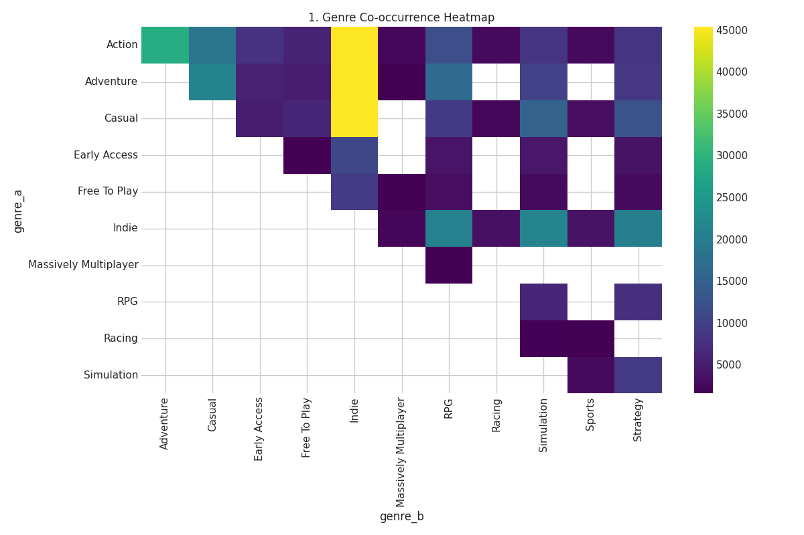
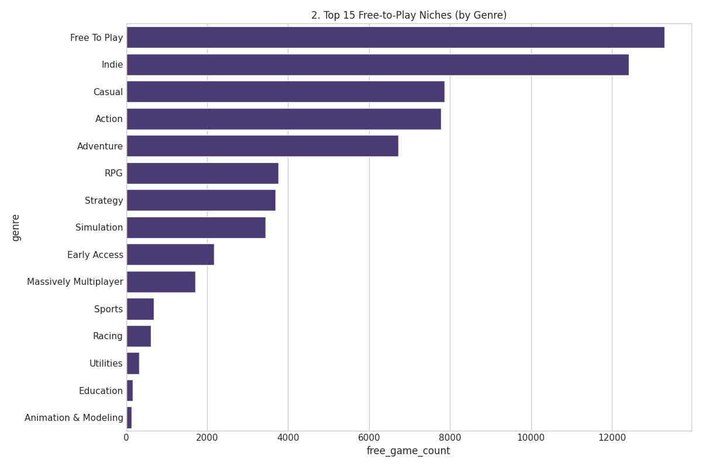
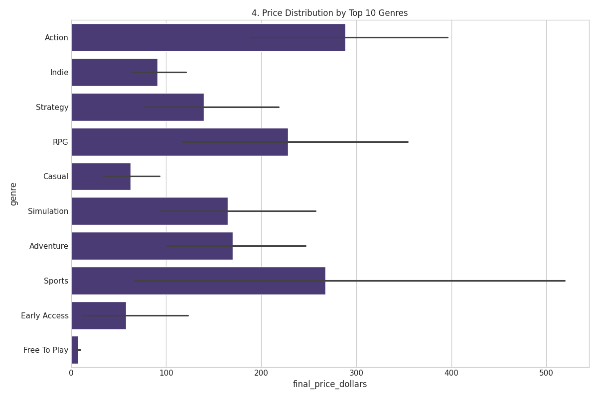
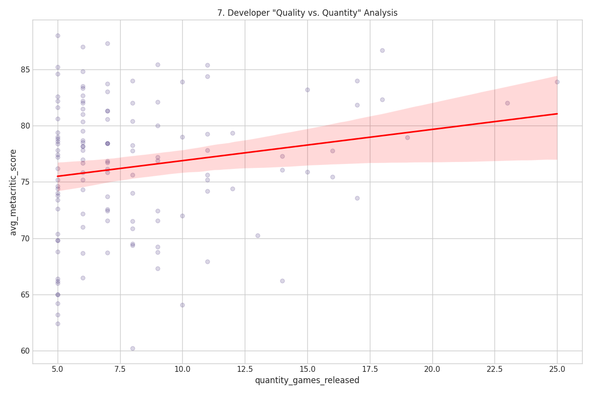
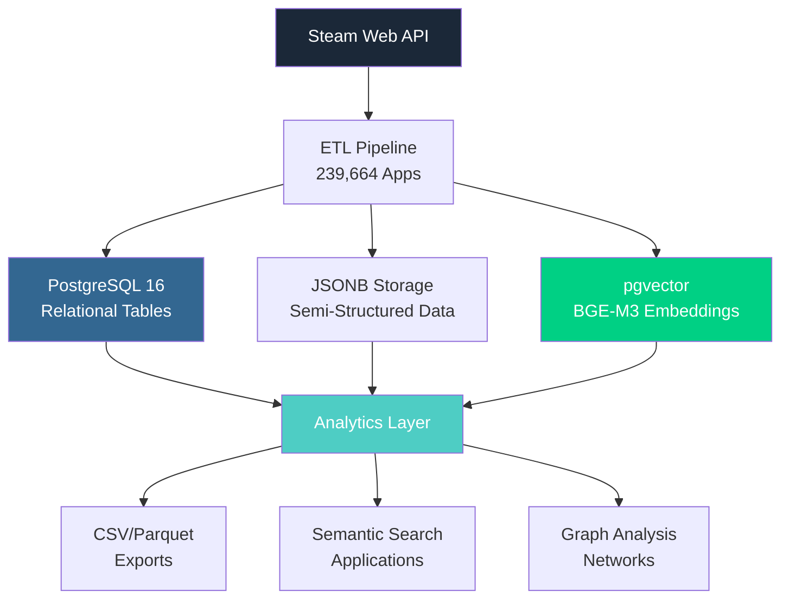

# Steam Dataset 2025: Multi-Modal Gaming Analytics Platform

> The first analytically-native Steam dataset employing multi-modal database architecture for advanced data science workflows. 239,664 applications with semantic search, graph analysis, and comprehensive metadata.

[](https://doi.org/10.5281/zenodo.17286923)
[](https://github.com/VintageDon/steam-dataset-2025)
[](https://creativecommons.org/licenses/by/4.0/)
[](https://www.python.org/downloads/)
[](https://www.postgresql.org/)
[](https://github.com/pgvector/pgvector)

Steam Dataset 2025 moves beyond traditional CSV exports to enable semantic search, graph analysis, and machine learning applications impossible with flat-file datasets. Built exclusively from official Steam Web APIs using systematic RAVGV methodology with complete transparency and reproducibility.

---

## 🎯 **Quick Start**

### **For Researchers**

- **[📥 Download Dataset (Zenodo)](https://doi.org/10.5281/zenodo.17286923)** - Complete dataset with DOI citation
- **[📊 Explore on Kaggle](#)** - Interactive notebooks and community discussions *(Coming Soon)*
- **[📖 Dataset Card](steam-dataset-2025-v1/DATASET_CARD.md)** - Complete methodology and academic documentation
- **[📚 Data Dictionary](steam-dataset-2025-v1/DATA_DICTIONARY.md)** - Comprehensive field specifications

### **For Data Scientists**

- **[🚀 Jupyter Notebooks](notebooks/)** - 3 production-ready analysis examples with PDF exports
- **[📈 Sample Visualizations](assets/steam-fulldataset-dataset-plots-initial/)** - Production analytics gallery
- **[💻 Python Scripts](scripts/)** - Complete ETL pipeline and processing code
- **[🔍 Getting Started Guide](docs/data-access.md)** - From download to first analysis

### **For Developers**

- **[🏗️ Database Schema](docs/postgresql-database-schema.md)** - PostgreSQL 16 with pgvector implementation
- **[⚡ Vector Embeddings](docs/methodologies/vector-embeddings.md)** - BGE-M3 semantic search setup
- **[🔧 Multi-Modal Architecture](docs/methodologies/multi-modal-db-architecture.md)** - Hybrid database design patterns

---

## 🌟 **What Makes This Different**

### **Scale & Completeness**

| **Metric** | **Value** | **Coverage** |
|------------|-----------|--------------|
| **Total Applications** | 239,664 | Complete accessible Steam catalog |
| **User Reviews** | 1,048,148 | Full review corpus with metadata |
| **Developers** | 54,321 | Complete developer ecosystem |
| **Publishers** | 39,876 | Full publisher network |
| **Temporal Range** | 1997-2025 | 28 years of platform evolution |
| **Success Rate** | 56% | Transparent quality metrics |

### **Unique Capabilities**

✅ **API-Pure Methodology** - Exclusively official Steam Web APIs, no scraping or estimates  
✅ **Semantic Search** - 1024-dimensional BGE-M3 embeddings for content-based discovery  
✅ **Multi-Modal Database** - PostgreSQL + JSONB + vector embeddings in unified architecture  
✅ **Graph Analysis Ready** - Publisher/developer relationships and collaboration networks  
✅ **Academic Standards** - Complete transparency, reproducibility, and peer-review documentation  
✅ **Production Tested** - 134,000+ successful retrievals with comprehensive validation

---

## 📊 **Production Analytics Showcase**

*Visual insights from 239,664 Steam applications demonstrating analytical capabilities*

<table>
  <tr>
    <td width="50%">
      
      <p align="center"><strong>Genre Co-occurrence Patterns</strong><br/>Multi-dimensional genre relationships reveal market structure</p>
    </td>
    <td width="50%">
      
      <p align="center"><strong>Free-to-Play Market Dynamics</strong><br/>Genre-specific monetization strategy analysis</p>
    </td>
  </tr>
  <tr>
    <td width="50%">
      
      <p align="center"><strong>Pricing Distribution by Genre</strong><br/>Market positioning and pricing tier analysis</p>
    </td>
    <td width="50%">
      
      <p align="center"><strong>Developer Portfolio Strategies</strong><br/>Quality vs quantity trade-offs in game development</p>
    </td>
  </tr>
</table>

**[📸 View Complete Gallery](assets/steam-fulldataset-dataset-plots-initial/)** - 12 production-scale visualizations

---

## 🏗️ **Architecture Overview**

Steam Dataset 2025 employs a sophisticated multi-modal database architecture combining relational, document, and vector storage.



### **Why Multi-Modal?**

- **Relational Layer**: Normalized entities with referential integrity for traditional SQL queries
- **Document Layer**: JSONB preserves complete API responses without information loss
- **Vector Layer**: Semantic embeddings enable content-based search and similarity analysis
- **Analytics Layer**: Materialized columns and optimized indexes for sub-second query performance

**[📖 Read Full Architecture Guide](docs/methodologies/multi-modal-db-architecture.md)**

---

## 📁 **Repository Structure**

```
steam-dataset-2025/
├── 🎨 assets/                      # Visualizations and sponsor materials
│   ├── sponsors/                   # Sponsor logos and acknowledgments
│   └── steam-fulldataset-dataset-plots-initial/  # Production charts
├── 💾 data/                        # Dataset access and samples
│   ├── 01_raw/                     # Original API responses (5K sample)
│   ├── 02_processed/               # Cleaned and validated data
│   ├── 03_enriched/                # Vector embeddings and features
│   └── 04_analytics/               # Final export packages
├── 📚 docs/                        # Technical documentation
│   ├── analytics/                  # Analysis reports and methodologies
│   ├── methodologies/              # Data collection and processing guides
│   └── citation.md                 # Citation guide
├── 🗂️ documentation-standards/    # Template and style guides
├── 💻 scripts/                     # Complete ETL pipeline (12 phases)
│   ├── 01-dataset-foundations/
│   ├── 02-steam-data-sample/
│   ├── 03-analyze-steam-data-sample/
│   ├── 04-postgresql-schema-analysis/
│   ├── 05-5000-steam-game-dataset-analysis/
│   ├── 06-full-data-set-import/
│   ├── 07-vector-embeddings/
│   ├── 08-materialization-columns/
│   ├── 09-pc-requirements-materialization/
│   ├── 10-pc-requirements-validation/
│   ├── 11-packaging-the-release/
│   └── 12-notebook-generation/
├── 📦 steam-dataset-2025-v1/      # Dataset release package
│   ├── DATASET_CARD.md             # Academic documentation
│   ├── DATA_DICTIONARY.md          # Complete field specifications
│   ├── notebook-data/              # Pre-exported notebook datasets
│   │   ├── 01-platform-evolution/
│   │   ├── 02-semantic-game-discovery/
│   │   └── 03-the-semantic-fingerprint/
│   └── notebooks/                  # Published Jupyter notebooks with PDFs
│       ├── 01-steam-platform-evolution-and-marketplace/
│       ├── 02-semantic-game-discovery/
│       └── 03-the-semantic-fingerprint/
└── 📝 work-logs/                   # Complete development history
    ├── 01-dataset-foundations/
    ├── 02-steam-data-sample/
    ├── 03-analyze-steam-data-sample/
    ├── 04-postgresql-schema-analysis/
    ├── 05-5000-steam-game-dataset-analysis/
    ├── 06-full-data-set-import/
    ├── 07-vector-embeddings/
    ├── 08-materialization-columns/
    ├── 09-pc-requirements-materialization/
    └── 10-dataset-accessibility-packages/
```

### **Navigation Guide**

- **[📥 Data Access](data/)** - Download datasets and access documentation
- **[📓 Notebooks](steam-dataset-2025-v1/notebooks/)** - Interactive analysis examples with full PDF exports
- **[📖 Documentation](docs/)** - Complete technical specifications
- **[💻 Scripts](scripts/)** - Full ETL pipeline and processing code
- **[📝 Work Logs](work-logs/)** - Development journey and methodology decisions
- **[📦 Dataset Package](steam-dataset-2025-v1/)** - Official release with academic documentation

---

## 🔬 **Technology Stack**

### **Data Collection & Processing**

- **Python 3.9+** - Core ETL pipeline and processing infrastructure
- **Steam Web API** - Official Valve endpoints with comprehensive rate limiting
- **Systematic Validation** - Multi-stage quality assurance and integrity checking
- **Error Handling** - Robust retry logic and comprehensive failure tracking

### **Database & Storage**

- **PostgreSQL 16.10** - Production database with advanced features
- **pgvector 0.5.0** - Vector similarity search with HNSW indexes
- **JSONB** - Flexible semi-structured data storage preserving API responses
- **Materialized Views** - Performance optimization for common query patterns

### **Advanced Analytics**

- **BGE-M3 Embeddings** - 1024-dimensional semantic vectors for content analysis
- **Sentence Transformers** - High-performance embedding generation
- **pandas & NumPy** - Data manipulation and analytical processing
- **matplotlib & seaborn** - Publication-quality visualization generation

---

## 📓 **Available Notebooks**

Three production-ready Jupyter notebooks demonstrate dataset capabilities with complete documentation and PDF exports:

### **[01: Platform Evolution & Market Landscape](steam-dataset-2025-v1/notebooks/01-steam-platform-evolution-and-marketplace/)**

**Research Questions:**

- How has Steam's catalog evolved across 28 years (1997-2025)?
- Which genres drive platform growth and pricing strategy changes?
- What patterns emerge in cross-platform support (Windows/Mac/Linux)?

**[📓 View Notebook (.ipynb)](steam-dataset-2025-v1/notebooks/01-steam-platform-evolution-and-marketplace/notebook-01-steam-platform-evolution-and-market-landscape.ipynb) | [📄 Download PDF](steam-dataset-2025-v1/notebooks/01-steam-platform-evolution-and-marketplace/notebook-01-steam-platform-evolution.pdf)**

---

### **[02: Semantic Game Discovery](steam-dataset-2025-v1/notebooks/02-semantic-game-discovery/)**

**Research Questions:**

- How do vector embeddings capture game concepts beyond keywords?
- Can semantic search discover similar games across genre boundaries?
- What representative games best exemplify each major genre?

**[📓 View Notebook (.ipynb)](steam-dataset-2025-v1/notebooks/02-semantic-game-discovery/02-semantic-game-discovery.ipynb) | [📄 Download PDF](steam-dataset-2025-v1/notebooks/02-semantic-game-discovery/notebook-02-semantic-game-discovery.pdf)**

---

### **[03: The Semantic Fingerprint](steam-dataset-2025-v1/notebooks/03-the-semantic-fingerprint/)**

**Research Questions:**

- Can descriptions alone predict genres better than metadata?
- How does class imbalance affect ML performance at scale?
- Which genres are most predictable from text descriptions?

**[📓 View Notebook (.ipynb)](steam-dataset-2025-v1/notebooks/03-the-semantic-fingerprint/03-the-semantic-fingerprint.ipynb) | [📄 Download PDF](steam-dataset-2025-v1/notebooks/03-the-semantic-fingerprint/notebook-03-the-semantic-fingerprint.pdf)**

---

**All notebooks include:**

- ✅ Pre-exported CSV/Parquet data files (no database required)
- ✅ Kaggle-ready with automatic environment detection
- ✅ Complete PDF exports for offline reading
- ✅ Reproducible code with fixed random seeds
- ✅ Publication-quality visualizations

**[🚀 Explore All Notebooks](steam-dataset-2025-v1/notebooks/)**

---

## 🎯 **Use Cases & Applications**

### **Gaming Industry Research**

- **Market Intelligence**: Genre evolution, pricing strategies, platform dynamics
- **Publisher Analytics**: Portfolio analysis, collaboration networks, market positioning
- **Trend Forecasting**: Release patterns, hardware requirements, monetization shifts
- **Competitive Analysis**: Market segmentation, success patterns, niche identification

### **Machine Learning Applications**

- **Semantic Search**: Content-based game discovery and recommendation systems
- **NLP Research**: Sentiment analysis, review classification, description clustering
- **Graph Analysis**: Developer networks, publisher relationships, ecosystem mapping
- **Predictive Modeling**: Success prediction, genre classification, requirement estimation

### **Academic Research**

- **Digital Economics**: Platform economics, marketplace dynamics, pricing theory
- **Data Science Education**: Multi-modal databases, vector search, ETL pipelines
- **HCI Studies**: User engagement patterns, review behavior, interface effectiveness
- **Methodology Research**: API-based collection, reproducibility frameworks, RAVGV methodology

---

## 🚀 **Getting Started**

### **Quick Start for Data Scientists**

```bash
# 1. Clone repository
git clone https://github.com/vintagedon/steam-dataset-2025.git
cd steam-dataset-2025

# 2. Set up Python environment
python -m venv venv
source venv/bin/activate  # Windows: venv\Scripts\activate
pip install -r requirements.txt

# 3. Download dataset from Zenodo or Kaggle
# See data/README.md for download instructions

# 4. Explore notebooks
jupyter notebook notebooks/
```

### **Quick Start for Researchers**

1. **Download Dataset**: Access via [Zenodo](https://doi.org/10.5281/zenodo.17286923) or Kaggle
2. **Read Documentation**: Start with [Dataset Card](steam-dataset-2025-v1/DATASET_CARD.md)
3. **Explore Examples**: Review [Jupyter notebooks](notebooks/) with PDF exports
4. **Cite Properly**: Follow [Citation Guide](docs/citation.md) for academic use

### **Quick Start for Developers**

1. **Review Architecture**: Read [Multi-Modal DB Guide](docs/methodologies/multi-modal-db-architecture.md)
2. **Setup Database**: Follow [PostgreSQL Schema](docs/postgresql-database-schema.md) documentation
3. **Explore Worklogs**: Review [Worklogs Documentation](work-logs/) for ETL implementation
4. **Implement Features**: Use [Vector Embeddings](docs/methodologies/vector-embeddings.md) guide

---

## 📖 **Complete Documentation**

### **Dataset Documentation**

- **[📦 Dataset Card](steam-dataset-2025-v1/DATASET_CARD.md)** - Complete academic documentation
- **[📚 Data Dictionary](steam-dataset-2025-v1/DATA_DICTIONARY.md)** - All 239,664 records field specifications
- **[📥 Data Access Guide](docs/data-access.md)** - Download and usage instructions
- **[⚠️ Known Limitations](docs/limitations.md)** - Transparent constraint documentation

### **Technical Documentation**

- **[🏗️ PostgreSQL Schema](docs/postgresql-database-schema.md)** - Complete database implementation
- **[⚡ Performance Guide](docs/postgresql-database-performance.md)** - Query optimization strategies
- **[🔧 Multi-Modal Architecture](docs/methodologies/multi-modal-db-architecture.md)** - Hybrid design patterns
- **[🧠 Vector Embeddings](docs/methodologies/vector-embeddings.md)** - BGE-M3 implementation

### **Methodology Documentation**

- **[🔬 Steam API Collection](docs/methodologies/steam-api-collection.md)** - Data acquisition methodology
- **[✅ Data Validation](docs/methodologies/data-validation-and-qa.md)** - Quality assurance processes
- **[🤝 AI-Human Collaboration](docs/methodologies/ai-human-collaboration-methodology.md)** - RAVGV framework
- **[📊 Analytics Studies](docs/analytics/)** - Analytical methodologies and findings

### **Development History**

- **[📝 Work Logs](work-logs/)** - Complete 10-phase development journey
- **[💻 Scripts Documentation](scripts/)** - Full ETL pipeline implementation
- **[📓 Notebook Development](notebooks/)** - Analysis workflow documentation

---

## 🌐 **Dataset Access**

### **Official Releases**

#### **Zenodo (Recommended for Research)**

[](https://doi.org/10.5281/zenodo.17286923)

**Complete Dataset Package:**

- Full PostgreSQL database dump (2.8GB compressed)
- CSV export package (85MB core data)
- Parquet files for big data workflows (45MB compressed)
- Vector embeddings (520MB)
- Complete documentation and notebooks

**Advantages:**

- Permanent DOI for citation
- Version controlled releases
- Academic hosting
- Long-term preservation

**[📥 Download from Zenodo](https://doi.org/10.5281/zenodo.17286923)**

---

#### **Kaggle (Coming Soon)**

**Interactive Dataset with Community:**

- Pre-loaded notebook environment
- Discussion forums and competitions
- Version tracking and forking
- Collaborative analysis

**Advantages:**

- No download required
- Instant Jupyter environment
- Community engagement
- GPU acceleration available

**[📊 Explore on Kaggle](#)** *(Release Pending)*

---

### **Sample Dataset (Immediate Access)**

**5K Game Sample** - Available directly in repository:

- 5,000 games with complete metadata
- Representative sample across genres and eras
- Immediate download (no external hosting)
- Perfect for testing and development

**[📥 Access Sample Data](data/01_raw/)** (102MB compressed)

---

## 🤝 **Contributing**

We welcome contributions from the data science and gaming research communities.

### **Ways to Contribute**

- **📊 Analytics Development** - New analytical frameworks and visualization approaches
- **📖 Documentation Enhancement** - Improved guides and methodological documentation
- **⚡ Performance Optimization** - Database and query performance improvements
- **🔬 Research Applications** - Novel use cases and analytical discoveries

### **Contribution Process**

1. Fork the repository and create a feature branch
2. Follow existing code style and documentation standards
3. Include tests and documentation for new features
4. Submit pull request with clear description
5. Participate in code review process

**[📋 Code of Conduct](CODE_OF_CONDUCT.md)** - Community guidelines and expectations

---

## 💼 **Industry Support & Sponsorship**

### **Platinum Sponsor**

<div align="center">
  <a href="https://msp4.com/" target="_blank">
    
  </a>
</div>

**[MSP4 LLC](https://msp4.com/)** - Leading managed IT services provider supporting innovative data science and research initiatives. MSP4's enterprise infrastructure expertise enables the robust technical foundation that makes large-scale projects like Steam Dataset 2025 possible.

---

### **Become a Sponsor**

Support open data science research and gain visibility in the analytics community.

**Sponsorship Benefits:**

- 🏆 Logo placement in project documentation and README
- 📊 Early access to analytical findings and market intelligence
- 🤝 Technical collaboration opportunities
- 🎯 Industry leadership association with data innovation

**[Contact for Sponsorship Opportunities](https://github.com/vintagedon)**

---

## 📜 **Citation & Academic Use**

### **BibTeX Citation**

```bibtex
@dataset{fountain_2025_steam,
  author       = {Fountain, Donald},
  title        = {{Steam Dataset 2025: Multi-Modal Gaming 
                   Analytics Platform}},
  month        = jan,
  year         = 2025,
  publisher    = {Zenodo},
  version      = {1.0.0},
  doi          = {10.5281/zenodo.17286923},
  url          = {https://doi.org/10.5281/zenodo.17286923}
}
```

### **APA Citation**

```
Fountain, D. (2025). Steam Dataset 2025: Multi-Modal Gaming Analytics 
Platform (Version 1.0.0) [Data set]. Zenodo. 
https://doi.org/10.5281/zenodo.17286923
```

**[📖 Complete Citation Guide](docs/citation.md)** - Additional formats and attribution guidelines

---

## ⚖️ **License & Legal**

### **Dataset License**

This dataset is licensed under **[Creative Commons Attribution 4.0 International (CC BY 4.0)](https://creativecommons.org/licenses/by/4.0/)**

**You are free to:**

- ✅ Share - Copy and redistribute in any medium or format
- ✅ Adapt - Remix, transform, and build upon the material
- ✅ Commercial Use - Use for any purpose, including commercial

**Under these terms:**

- 📝 Attribution - Give appropriate credit and link to license
- 🔓 No Additional Restrictions - No legal/technical measures limiting permitted uses

### **Code License**

Repository code and scripts are licensed under **[MIT License](LICENSE)**

**[📄 View Full License](LICENSE)**

---

## 📞 **Contact & Support**

### **Project Maintainer**

**Donald Fountain (VintageDon)**

- **GitHub**: [@vintagedon](https://github.com/vintagedon)
- **ORCID**: [0009-0008-7695-4093](https://orcid.org/0009-0008-7695-4093)

### **Get Help**

- **🐛 Issues & Bugs**: [GitHub Issues](https://github.com/vintagedon/steam-dataset-2025/issues)
- **💬 Discussions**: [GitHub Discussions](https://github.com/vintagedon/steam-dataset-2025/discussions)
- **📧 General Inquiries**: Contact via GitHub
- **💼 Sponsorship**: Partnership opportunities via GitHub

---

## 🎓 **Academic Credentials**

This dataset follows academic standards for transparency and reproducibility:

✅ **Complete Methodology Documentation** - Every collection and processing decision documented  
✅ **Reproducible Pipeline** - All code and scripts provided for validation  
✅ **Quality Assurance** - Systematic validation with transparent success metrics  
✅ **Limitation Disclosure** - Known constraints and biases fully documented  
✅ **Version Control** - Complete development history preserved  
✅ **Peer Review Ready** - Structured documentation following Gebru et al. datasheet standards  

---

## 🏆 **Project Milestones**

| **Phase** | **Milestone** | **Status** | **Documentation** |
|-----------|---------------|------------|-------------------|
| **Phase 1** | API Foundation & Validation | ✅ Complete | [Work Log 01](work-logs/01-dataset-foundations/) |
| **Phase 2** | Sample Collection (179 apps) | ✅ Complete | [Work Log 02](work-logs/02-steam-data-sample/) |
| **Phase 3** | Schema Analysis & Design | ✅ Complete | [Work Log 03](work-logs/03-analyze-steam-data-sample/) |
| **Phase 4** | Database Pipeline (5K apps) | ✅ Complete | [Work Log 04](work-logs/04-postgresql-schema-analysis/) |
| **Phase 5** | Analytics Framework | ✅ Complete | [Work Log 05](work-logs/05-5000-steam-game-dataset-analysis/) |
| **Phase 6** | Full Dataset (239,664 apps) | ✅ Complete | [Work Log 06](work-logs/06-full-data-set-import/) |
| **Phase 7** | Vector Embeddings | ✅ Complete | [Work Log 07](work-logs/07-vector-embeddings/) |
| **Phase 8** | Performance Optimization | ✅ Complete | [Work Log 08](work-logs/08-materialization-columns/) |
| **Phase 9** | Hardware Extraction | ✅ Complete | [Work Log 09](work-logs/09-pc-requirements-materialization/) |
| **Phase 10** | Dataset Packaging | ✅ Complete | [Work Log 10](work-logs/10-dataset-accessibility-packages/) |
| **Release** | Zenodo Publication | ✅ Published | [DOI: 10.5281/zenodo.17286923](https://doi.org/10.5281/zenodo.17286923) |
| **Release** | Kaggle Publication | 🔄 Pending | Coming Soon |

---

## 🌟 **Why Steam Dataset 2025?**

### **Largest Public Steam Dataset**

- **239,664 applications** vs typical datasets of 6K-11K
- **1,048,148 reviews** with complete metadata
- **28 years** of platform evolution (1997-2025)
- **90.8% coverage** of accessible Steam catalog

### **First Multi-Modal Architecture**

- **PostgreSQL + JSONB + pgvector** in unified database
- **Semantic search** using BGE-M3 embeddings
- **Graph analysis ready** with relationship networks
- **Performance optimized** with materialized columns

### **Academic Standards**

- **Complete transparency** in methodology and limitations
- **Reproducible pipeline** with all code provided
- **Quality metrics** documented for all processing stages
- **Peer review ready** following Gebru et al. datasheet standards

### **Production Tested**

- **134,000+ successful** game metadata retrievals
- **Sub-second queries** on 239K application database
- **Validated** across multiple analytical use cases
- **Published notebooks** demonstrating capabilities

---

**Last Updated:** January 6, 2025 | **Project Status:** Production Complete | **Current Phase:** Public Release

*Dataset developed using systematic AI-human collaboration following RAVGV methodology*

---

<div align="center">

**⭐ Star this repository if you find it useful for your research!**

[](https://github.com/vintagedon/steam-dataset-2025/stargazers)
[](https://github.com/vintagedon/steam-dataset-2025/network/members)

</div>
