# 🎮 **Steam Dataset 2025**

### A Modernized, Multi-Modal Gaming Analytics Platform

[](https://github.com/vintagedon/steam-dataset-2025)
[](https://steamcommunity.com/dev)
[](https://www.postgresql.org/)
[](https://www.python.org/)
[](LICENSE)

**Steam Dataset 2025** is a comprehensive modernization of the influential 2019 Kaggle Steam Store Games dataset, rebuilt from the ground up using current Steam Web APIs and multi-modal database architecture. This project demonstrates modern data engineering practices through systematic AI-human collaboration using the RAVGV (Request-Analyze-Verify-Generate-Validate) methodology, creating the first analytically-native Steam dataset optimized for advanced data science workflows rather than simple CSV exports.

This project operates within the [Proxmox Astronomy Lab](https://github.com/Proxmox-Astronomy-Lab/proxmox-astronomy-lab) infrastructure and adopts its enterprise documentation standards and systematic AI collaboration methodologies. The RAVGV framework ensures rigorous validation at each development phase, from API design through final data validation.

---

## 🎯 **Project Vision**

This project addresses the limitations of existing Steam datasets by creating a technically sophisticated, relationship-aware data platform that enables advanced analytics impossible with traditional flat-file approaches.

- **🔄 Complete Modernization:** Full rebuild using official Steam Web APIs, eliminating dependency on third-party services like SteamSpy
- **🧠 Multi-Modal Architecture:** PostgreSQL + pgvector + Neo4j for relational, vector, and graph capabilities
- **🌐 Ecosystem Approach:** Comprehensive coverage of games, DLC, software, and digital content relationships
- **📊 Analytics-First Design:** Purpose-built for advanced data science applications

### **What Makes This Different**

- **Multi-Database Architecture:** First Steam dataset using relational, vector, and graph databases
- **Complete Steam Ecosystem:** Games, DLC, Fantasy Grounds content, RPG Maker assets, development tools
- **Relationship Intelligence:** Publisher networks, content dependencies, genre evolution patterns
- **Modern Data Stack:** Designed for semantic search, recommendation engines, and network analysis

### **Expected Impact**

- **🎯 Superior Analytics:** Enable analysis impossible with flat CSV files
- **📈 Industry Insights:** Graph-based publisher and developer relationship analysis
- **🤖 ML Applications:** Genre classification, sentiment analysis, recommendation systems
- **📚 Educational Resource:** Demonstrate systematic AI-assisted data engineering methodology

---

## 📁 **Repository Structure**

```markdown
steam-dataset-2025/
├── 🐍 src/                     # Core Python modules and classes
├── 📜 scripts/                 # Collection, processing, and utility scripts
├── 🗄️ database/                # Schema definitions and migration scripts
├── 📊 analytics/               # Analysis notebooks and ML models
├── 🚀 api/                     # FastAPI analytical endpoints
├── 📋 config/                  # Configuration templates and examples
├── 📚 docs/                    # Technical documentation and methodology
├── 🧪 tests/                   # Comprehensive test suite
├── 🐳 docker/                  # Containerization and deployment configs
├── 📈 examples/                # Usage examples and tutorials
├── 🔧 requirements.txt         # Python dependencies
├── 🐙 docker-compose.yml       # Multi-service orchestration
├── 📋 ROADMAP.md               # Detailed development roadmap
└── 📖 README.md                # This file
```

### **Key Documentation**

- **[📋 Development Roadmap](ROADMAP.md)** - Complete 16-week implementation plan
- **[📚 Technical Documentation](docs/README.md)** - Architecture and methodology details
- **[🗄️ Database Schema](database/README.md)** - Comprehensive schema documentation
- **[📊 Analytics Guide](analytics/README.md)** - Advanced analysis examples

---

## 🏗️ **Architecture Overview**

The platform employs a sophisticated multi-modal persistence strategy, with each database optimized for specific analytical tasks.

### **Data Collection Pipeline**

```mermaid
graph TD
    A[Steam Web API<br/>🔌 263K+ Applications] --> B[Python Collection Scripts<br/>📥 Rate-Limited Ingestion]
    B --> C[Raw JSON Storage<br/>📄 Complete API Responses]
    C --> D[PostgreSQL Staging<br/>🗃️ JSONB Tables]
    D --> E[Data Normalization<br/>🔄 Relational Schema]
    E --> F[Multi-Modal Population<br/>🎯 Specialized Databases]
    
    F --> G[PostgreSQL<br/>🐘 Structured Data]
    F --> H[pgvector<br/>🧠 Semantic Embeddings]
    F --> I[Neo4j<br/>🕸️ Relationship Networks]
    
    G --> J[Analytics Platform<br/>📊 Advanced Queries]
    H --> J
    I --> J
    
    style A fill:#1b2838
    style D fill:#336791
    style H fill:#00d084
    style I fill:#008cc1
```



### **Database Architecture**

| **Database** | **Purpose** | **Key Capabilities** |
|-------------|-------------|---------------------|
| **PostgreSQL** | Primary structured data store | Normalized schema, complex queries, ACID compliance |
| **pgvector** | Semantic search and similarity | Game description embeddings, content-based recommendations |
| **Neo4j** | Relationship analysis | Publisher networks, DLC hierarchies, developer collaborations |

### **Data Sources & Scope**

- **Steam Web API:** Official appdetails, reviews, and app list endpoints
- **Content Types:** Games, DLC, software, videos, demos, tools
- **Geographic Coverage:** Global catalog with regional pricing data
- **Temporal Scope:** Complete historical data with incremental updates

---

## 📊 **Dataset Features**

### **Core Application Data**

- **Comprehensive Metadata:** Names, descriptions, pricing, release dates
- **Rich Content:** HTML descriptions with embedded media, system requirements
- **Platform Support:** Windows, Mac, Linux compatibility matrices
- **Business Information:** Developers, publishers, distribution relationships

### **Relationship Networks**

- **DLC Hierarchies:** Parent-child relationships between games and expansions
- **Publisher Ecosystems:** Complex networks of publishing relationships
- **Genre Evolution:** Multi-label classification with temporal analysis
- **Content Dependencies:** Software tool relationships (RPG Maker, Fantasy Grounds)

### **User Engagement Data**

- **Review Analytics:** Complete review text, sentiment, user context
- **Achievement Systems:** Game-specific achievement data and statistics
- **Community Features:** Workshop integration, trading card support
- **User Behavior:** Playtime patterns, recommendation scores

### **Advanced Analytics Features**

```json
{
  "semantic_search": "Vector embeddings for content similarity",
  "graph_analysis": "Network analysis of industry relationships",
  "temporal_tracking": "Price history and release pattern analysis",
  "multi_language": "International content with localization data",
  "media_assets": "Screenshot and trailer URL management"
}
```

---

## 🛠️ **Technology Stack**

### **Collection Infrastructure**

- **🐍 Python 3.9+:** Core collection and processing scripts
- **📡 Requests:** HTTP client with retry logic and rate limiting
- **⏰ Time Management:** Conservative API rate limiting (1.5s delays)
- **🔄 Error Handling:** Exponential backoff with comprehensive logging

### **Database Layer**

- **🐘 PostgreSQL 16:** Primary relational database with JSONB support
- **🧠 pgvector Extension:** Vector similarity search capabilities
- **🕸️ Neo4j:** Graph database for relationship analysis
- **📈 Query Optimization:** Strategic indexing and query performance tuning

### **Analysis Environment**

- **🔬 Scientific Python:** NumPy, Pandas, SciPy for data manipulation
- **🤖 Machine Learning:** Scikit-learn, Transformers for ML applications
- **📊 Visualization:** Matplotlib, Seaborn, Plotly for data visualization
- **🌐 Web Framework:** FastAPI for analytical API endpoints

### **Infrastructure Requirements**

- **💾 Storage:** ~100GB for complete dataset with media URLs
- **🧮 Memory:** 16GB+ RAM recommended for large-scale analysis
- **⚡ Compute:** Multi-core CPU for embedding generation
- **🌐 Network:** Sustained internet connection for API collection

---

## 📈 **Analytics Showcase**

The multi-modal architecture enables analytical capabilities impossible with traditional datasets:

### **Semantic Game Discovery**

```python
# Find games similar to "Cyberpunk 2077" using vector embeddings
similar_games = vector_db.similarity_search(
    game="Cyberpunk 2077", 
    limit=10,
    filters={"genre": "RPG", "release_year": "> 2020"}
)
```

### **Publisher Network Analysis**

```python
# Identify influential publishers using graph centrality
publisher_influence = graph_db.run_query("""
    MATCH (p:Publisher)-[:PUBLISHED]->(g:Game)
    RETURN p.name, count(g) as games_published,
           apoc.centrality.degree(p) as network_centrality
    ORDER BY network_centrality DESC
""")
```

### **Genre Evolution Tracking**

```python
# Analyze genre popularity trends over time
genre_trends = sql_db.execute("""
    SELECT genre, release_year, COUNT(*) as game_count,
           AVG(positive_rating_ratio) as avg_rating
    FROM games g JOIN game_genres gg ON g.appid = gg.appid
    GROUP BY genre, release_year
    ORDER BY release_year, game_count DESC
""")
```

---

## 🎯 **Project Status**

**Current Phase:** Infrastructure development and initial collection  
**Next Milestone:** Complete API collection pipeline  
**Timeline:** 16-week development roadmap

### **Development Phases**

| **Phase** | **Duration** | **Key Deliverable** | **Status** |
|-----------|-------------|-------------------|------------|
| **API Testing & Framework** | 2 Weeks | Validated collection scripts | 🔄 In Progress |
| **Database Schema Design** | 1 Week | Normalized database architecture | ⏳ Pending |
| **Full Catalog Collection** | 1 Week | Complete Steam dataset (3-5 days runtime) | ⏳ Pending |
| **Multi-Modal Population** | 2 Weeks | Vector and graph database integration | ⏳ Pending |
| **Analytics Development** | 3 Weeks | ML models and analytical frameworks | ⏳ Pending |
| **Documentation & Release** | 2 Weeks | Complete documentation and public release | ⏳ Pending |

### **Blog Series Development**

This project is documented through a comprehensive blog series demonstrating AI-assisted data engineering:

- **Post 1:** Project inception and API exploration
- **Post 2:** Database architecture and collection strategy  
- **Post 3:** Multi-modal integration and relationship modeling
- **Post 4:** Advanced analytics and machine learning applications

---

## 🌟 **Competitive Advantages**

### **vs. Existing 2024/2025 Steam Datasets**

| **Feature** | **Existing Datasets** | **Steam Dataset 2025** |
|-------------|----------------------|------------------------|
| **Data Architecture** | Single CSV files | Multi-modal database platform |
| **API Sources** | Mixed Steam/SteamSpy | Official Steam Web API only |
| **Relationship Data** | Flat associations | Graph database with network analysis |
| **Semantic Capabilities** | Keyword search only | Vector embeddings for similarity |
| **Analytics Scope** | Descriptive statistics | Predictive ML and network analysis |
| **Update Strategy** | Periodic snapshots | Real-time incremental updates |

### **Technical Innovations**

- **First Multi-Modal Steam Dataset:** Applied modern database architecture to gaming analytics
- **Complete Ecosystem Coverage:** Games, DLC, tools, content creation platforms
- **Systematic AI Collaboration:** RAVGV methodology ensuring rigorous development process
- **Modern Data Stack:** Demonstrates current best practices in data engineering

---

## 🤖 **AI Collaboration Methodology**

This project demonstrates systematic AI-human collaboration in data engineering using the RAVGV framework:

### **RAVGV Implementation**

- **Request:** Define data collection requirements and analytical objectives
- **Analyze:** AI assists with architecture design and implementation planning
- **Verify:** Human expert validates AI proposals before implementation
- **Generate:** Create collection scripts, database schemas, analysis frameworks  
- **Validate:** Final quality assurance of generated artifacts and methodologies

### **Development Approach**

- **🤝 Structured Collaboration:** Formal methodology ensures consistent quality
- **📖 Documentation-First:** All development documented for reproducibility
- **🔬 Iterative Validation:** Continuous testing and refinement of approaches
- **🌐 Transparent Process:** Complete development conversations preserved

### **AI Integration Points**

- **Architecture Design:** Database schema optimization and relationship modeling
- **Code Development:** Collection scripts, data processing pipelines
- **Analysis Frameworks:** ML model development and analytical approaches
- **Documentation:** Technical writing and methodology explanation

---

## 🤝 **Contributing**

This project welcomes contributions across multiple domains:

### **Development Areas**

- **🔧 Collection Infrastructure:** API optimization, error handling, rate limiting
- **🗄️ Database Engineering:** Schema optimization, query performance, indexing
- **🧠 ML Applications:** Model development, feature engineering, validation
- **📊 Analytics:** Visualization, statistical analysis, reporting frameworks

### **Contribution Guidelines**

1. Review the [Development Roadmap](ROADMAP.md) for current priorities
2. Check existing issues and discussions for collaboration opportunities
3. Follow documentation standards for all contributions
4. Include comprehensive tests for new functionality

### **Research Applications**

- Academic research in game industry analysis
- Educational use for data engineering methodology
- Community analysis and recommendation system development
- Industry trend analysis and market research

---

## 📄 **License**

This project is licensed under the MIT License - see the [LICENSE](LICENSE) file for details.

### **Citation Guidelines**

If you use this dataset or methodology in your work, please cite:

```bibtex
@misc{steam_dataset_2025,
  title={Steam Dataset 2025: A Multi-Modal Gaming Analytics Platform},
  author={VintageDon and Contributors},
  year={2025},
  url={https://github.com/vintagedon/steam-dataset-2025},
  note={Modernized Steam dataset with vector embeddings and graph analysis capabilities}
}
```

---

## 🙏 **Acknowledgments**

**Steam Dataset 2025** builds on the foundation established by the original 2019 Kaggle Steam Store Games dataset while demonstrating the evolution of data engineering practices through modern tools, systematic AI collaboration, and sophisticated analytical architectures.

### **Technology Foundation**

- **🎮 Steam Web API:** Official data access enabling comprehensive and reliable collection
- **🐘 PostgreSQL:** Robust relational database platform with advanced JSON capabilities  
- **🧠 pgvector:** Vector similarity search enabling semantic analysis capabilities
- **🕸️ Neo4j:** Graph database platform for relationship analysis and network insights
- **🐍 Python Ecosystem:** Scientific computing libraries enabling comprehensive analysis

### **Data Sources**

- **🔗 Original Dataset:** Nik Davis's 2019 Steam Store Games dataset as foundational reference
- **📊 Steam Community:** Official API access and comprehensive game metadata
- **🤖 AI Collaboration:** Claude AI assistance in architecture design and development methodology
- **🌐 Open Source Community:** Libraries, frameworks, and best practices enabling platform development

---

🎮 **Modern gaming dataset architecture** | **Built for advanced analytics and AI applications**

**Last Updated**: August 31, 2025 | **Project Status**: Active Development | **Next Release**: Q4 2025
