```mermaid
graph TD
    A[Steam Web API<br/>🔌 263K+ Applications] --> B[Python Collection Scripts<br/>📥 Rate-Limited Ingestion]
    B --> C[Raw JSON Storage<br/>📄 Complete API Responses]
    C --> D[Data Validation<br/>🔍 Integrity Checking]
    D --> E[PostgreSQL Import<br/>🗃️ Normalized Schema]
    E --> F[Enrichment Pipeline<br/>🧬 Feature Engineering]
    
    F --> G[PostgreSQL Core<br/>🐘 Structured Data]
    F --> H[pgvector Extension<br/>🧠 Semantic Embeddings]
    F --> I[Analytics Views<br/>📊 Materialized Queries]
    
    G --> J[Analytics Platform<br/>📈 Advanced Analysis]
    H --> J
    I --> J
    
    style A fill:#1b2838
    style E fill:#336791
    style H fill:#00d084
    style I fill:#e8f5e8
```

# 🎮 Steam Dataset 2025

### A Modernized, Multi-Modal Gaming Analytics Platform

[](https://github.com/vintagedon/steam-dataset-2025)
[](https://steamcommunity.com/dev)
[](https://www.postgresql.org/)
[](https://www.python.org/)
[](LICENSE)

Steam Dataset 2025 is a comprehensive modernization of the influential 2019 Kaggle Steam Store Games dataset, rebuilt from the ground up using current Steam Web APIs and multi-modal database architecture. This project demonstrates modern data engineering practices, creating the first analytically-native Steam dataset optimized for advanced data science workflows rather than simple CSV exports.

The project features a sophisticated PostgreSQL + pgvector architecture enabling semantic search, comprehensive relationship modeling, and advanced analytics capabilities impossible with traditional flat-file approaches.

---

## 🎯 Project Vision

This project addresses the limitations of existing Steam datasets by creating a technically sophisticated, relationship-aware data platform that enables advanced analytics impossible with traditional flat-file approaches.

- 🔄 Complete Modernization: Full rebuild using official Steam Web APIs, eliminating dependency on third-party services
- 🧠 Multi-Modal Architecture: PostgreSQL + pgvector for relational and semantic search capabilities
- 🌐 Ecosystem Approach: Comprehensive coverage of games, DLC, software, and digital content relationships
- 📊 Analytics-First Design: Purpose-built for advanced data science applications

### What Makes This Different

- Multi-Modal Database: First Steam dataset using PostgreSQL with vector search capabilities
- Complete Steam Ecosystem: Games, DLC, Fantasy Grounds content, RPG Maker assets, development tools
- Relationship Intelligence: Publisher networks, content dependencies, genre evolution patterns
- Modern Data Stack: Designed for semantic search, recommendation engines, and network analysis

### Current Achievements

- ✅ 5K Sample Dataset: Fully functional 5,000-game dataset with enriched reviews
- ✅ Production Database: PostgreSQL implementation with vector search and analytics
- ✅ Comprehensive Pipeline: Complete data validation, import, and enrichment infrastructure
- ✅ Analytics Framework: Initial market analysis and statistical profiling capabilities

---

## 📁 Repository Structure

```markdown
steam-dataset-2025/
├── 📊 data/                    # Raw and processed datasets
│   ├── 01_raw/                 # Original Steam API responses
│   └── 02_processed/           # Enriched and validated data
├── 📜 scripts/                 # Collection and processing pipeline
│   ├── 01-test-steam-api/      # API validation and testing
│   ├── 02-get_steam_data_sample/ # Data collection infrastructure
│   ├── 03-analyze_steam_data_schema/ # Schema analysis and validation
│   └── 04-postgres_schema_design/ # Database implementation pipeline
├── 📚 docs/                    # Technical documentation
│   ├── analytics/              # Analysis methodologies and results
│   ├── methodologies/          # Technical implementation guides
│   └── project_journal/        # Development milestone documentation
├── 📊 notebooks/               # Analytical notebooks and ML models
├── 📄 paper/                   # Academic publication materials
├── 📈 reports/                 # Comprehensive analytical reports
├── 📋 work-logs/               # Development progress documentation
├── 🔧 src/                     # Core Python modules (planned)
└── 📖 README.md                # This file
```

### Key Documentation

- [📊 Data Overview](data/README.md) - Complete data pipeline and dataset documentation
- [📜 Scripts Documentation](scripts/README.md) - Collection and processing pipeline guide
- [📚 Technical Documentation](docs/README.md) - Architecture and methodology details
- [🗄️ Database Schema](scripts/04-postgres_schema_design/README.md) - PostgreSQL implementation guide
- [📋 Work Logs](work-logs/README.md) - Development progress and decision tracking

---

## 🏗️ Architecture Overview

The platform employs a sophisticated multi-modal persistence strategy, with PostgreSQL optimized for both relational queries and vector similarity search.

### Data Collection Pipeline



### Database Architecture

| Component | Purpose | Key Capabilities |
|---------------|-------------|---------------------|
| PostgreSQL 16 | Primary data store | Normalized schema, JSONB support, ACID compliance |
| pgvector Extension | Semantic search | 384-dimensional embeddings, similarity queries |
| HNSW Indexes | Performance optimization | Sub-second similarity search across 260K+ games |
| Materialized Views | Analytics acceleration | Pre-computed aggregations and statistical summaries |

### Data Sources & Scope

- Steam Web API: Official appdetails, reviews, and app list endpoints
- Content Types: Games, DLC, software, videos, demos, tools (8,700+ applications in sample)
- Review Data: 36,000+ user reviews with full text and metadata
- Relationship Data: Developer/publisher networks, genre classifications, content hierarchies

---

## 📊 Dataset Features

### Core Application Data

- Comprehensive Metadata: Names, descriptions, pricing, release dates
- Rich Content: HTML descriptions with embedded media, system requirements
- Platform Support: Windows, Mac, Linux compatibility matrices
- Business Information: Developers, publishers, distribution relationships

### Advanced Analytics Capabilities

The multi-modal architecture enables sophisticated analytical applications:

Semantic Game Discovery

```sql
-- Find games similar to "Cyberpunk 2077" using vector embeddings
SELECT name, short_description, 
       description_embedding <=> %s AS similarity
FROM applications 
ORDER BY similarity 
LIMIT 10;
```

Publisher Network Analysis

```sql
-- Identify influential publishers by game count and average rating
SELECT p.name, COUNT(*) as game_count,
       AVG(a.metacritic_score) as avg_score
FROM publishers p
JOIN application_publishers ap ON p.id = ap.publisher_id
JOIN applications a ON ap.appid = a.appid
GROUP BY p.id, p.name
HAVING COUNT(*) >= 5
ORDER BY game_count DESC;
```

Genre Evolution Tracking

```sql
-- Analyze genre popularity trends over time
SELECT g.name as genre, 
       EXTRACT(year FROM a.release_date) as year,
       COUNT(*) as game_count
FROM genres g
JOIN application_genres ag ON g.id = ag.genre_id
JOIN applications a ON ag.appid = a.appid
WHERE a.release_date IS NOT NULL
GROUP BY g.name, EXTRACT(year FROM a.release_date)
ORDER BY year, game_count DESC;
```

---

## 🛠️ Technology Stack

### Data Collection & Processing

- 🐍 Python 3.9+: Core collection and processing infrastructure
- 📡 Steam Web API: Official API endpoints with comprehensive rate limiting
- 🔍 Data Validation: Systematic integrity checking and quality assurance
- 🔄 Error Handling: Robust retry logic and comprehensive logging

### Database & Analytics

- 🐘 PostgreSQL 16: Primary database with JSONB and vector support
- 🧠 pgvector Extension: 384-dimensional embeddings with HNSW indexing
- 📊 Analytics Framework: Materialized views and optimized query patterns
- ⚡ Performance Optimization: Strategic indexing and query optimization

### Infrastructure & Performance

Database Performance Benchmarks (from actual testing):

- Read-Only Queries: ~205,500 TPS with 0.078ms average latency
- Durable Writes: ~21,600 TPS with 1.48ms average latency
- Vector Similarity Search: Sub-second response across 260K+ embeddings
- Storage Efficiency: ~135MB for 8,700 applications with full enrichment

---

## 📈 Current Status & Results

### Completed Implementation

✅ Phase 1: API Foundation

- Complete Steam API integration and testing framework
- Validated data collection methodology with 5,000-game sample
- Comprehensive error handling and rate limiting implementation

✅ Phase 2: Database Pipeline

- PostgreSQL schema design with normalized relationship modeling
- Bulk import pipeline with transaction safety and rollback capability
- Data validation and integrity checking at multiple pipeline stages

✅ Phase 3: Analytics Infrastructure

- pgvector integration with 384-dimensional embedding support
- HNSW indexing for high-performance similarity search
- Initial analytics framework with statistical profiling capabilities

### Sample Dataset Achievements

| Metric | Value | Description |
|------------|-----------|-----------------|
| Total Applications | 8,711 | Games, DLC, software, and digital content |
| Core Games | 5,000 | Primary gaming applications with full metadata |
| User Reviews | 36,265 | Complete review text with user context |
| Unique Developers | 6,740 | Individual and studio developers |
| Unique Publishers | 5,605 | Publishing entities and networks |
| Database Size | ~2GB | Complete normalized database with indexes |

### Performance Validation

Query Performance:

- Simple analytical queries: <10ms response time
- Complex aggregations: 50-200ms response time
- Vector similarity search: 100-500ms across full dataset
- Multi-table joins: Optimized with strategic indexing

Data Quality Metrics:

- API success rate: 88.1% (higher than industry average)
- Data completeness: >95% for critical fields
- Validation pass rate: 100% for imported data
- Referential integrity: Complete with foreign key constraints

---

## 🌟 Competitive Advantages

### vs. Existing 2024/2025 Steam Datasets

| Feature | Traditional Datasets | Steam Dataset 2025 |
|-------------|------------------------|------------------------|
| Data Architecture | Single CSV files | Multi-modal database with vector search |
| API Sources | Mixed/outdated sources | Official Steam Web API exclusively |
| Relationship Data | Flat associations | Normalized relational schema |
| Search Capabilities | Keyword matching only | Semantic similarity with embeddings |
| Analytics Scope | Basic statistics | Advanced ML and network analysis |
| Update Methodology | Manual snapshots | Systematic pipeline with validation |
| Performance | File loading required | Sub-second query response |

### Technical Innovations

- First Vector-Enabled Steam Dataset: PostgreSQL + pgvector for semantic search
- Complete Pipeline Documentation: Reproducible methodology with comprehensive validation
- Production-Ready Architecture: Enterprise-grade database design with performance optimization
- Comprehensive Relationship Modeling: Developer networks, content hierarchies, genre evolution

---

## 🚀 Getting Started

### Quick Start with Sample Dataset

1. Clone Repository:

   ```bash
   git clone https://github.com/vintagedon/steam-dataset-2025.git
   cd steam-dataset-2025
   ```

2. Set Up Environment:

   ```bash
   python -m venv venv
   source venv/bin/activate  # Windows: venv\Scripts\activate
   pip install -r requirements.txt
   ```

3. Access Sample Data:
   - Raw Data: `data/01_raw/` - Original Steam API responses
   - Processed Data: `data/02_processed/` - Enriched and validated dataset
   - Database Schema: `scripts/04-postgres_schema_design/schema.sql`

4. Database Setup:

   ```bash
   cd scripts/04-postgres_schema_design
   # Configure .env file with PostgreSQL credentials
   python 04-02-setup-postgresql-schema.py
   python 04-03-import-json-to-pgsql.py
   ```

### Documentation Navigation

For different use cases, start with the appropriate documentation:

- Data Scientists: [Analytics Documentation](docs/analytics/README.md)
- Database Engineers: [Database Schema Guide](scripts/04-postgres_schema_design/README.md)
- API Developers: [Collection Scripts](scripts/README.md)
- Researchers: [Methodology Documentation](docs/methodologies/README.md)

---

## 🤝 Contributing

This project welcomes contributions across multiple domains:

### Development Areas

- 🔧 Data Collection: API optimization, error handling, rate limiting improvements
- 🗄️ Database Engineering: Schema optimization, query performance, indexing strategies
- 🧠 Analytics Applications: Statistical analysis, machine learning models, visualization
- 📊 Reporting Framework: Interactive reports, dashboard development, publication graphics

### Research Applications

- Academic Research: Gaming industry analysis, market dynamics, developer ecosystem studies
- Educational Resources: Data engineering methodology, database design, analytical techniques
- Community Analysis: Recommendation systems, user behavior analysis, content discovery
- Industry Intelligence: Market trends, competitive analysis, business strategy insights

---

## 📄 License

This project is licensed under the MIT License - see the [LICENSE](LICENSE) file for details.

### Citation Guidelines

If you use this dataset or methodology in your work, please cite:

```bibtex
@misc{steam_dataset_2025,
  title={Steam Dataset 2025: A Multi-Modal Gaming Analytics Platform},
  author={VintageDon and Contributors},
  year={2025},
  url={https://github.com/vintagedon/steam-dataset-2025},
  note={Modernized Steam dataset with PostgreSQL and vector search capabilities}
}
```

---

## 🙏 Acknowledgments

Steam Dataset 2025 builds on the foundation established by the original 2019 Kaggle Steam Store Games dataset while demonstrating the evolution of data engineering practices through modern database technologies and systematic analytical approaches.

### Technology Foundation

- 🎮 Steam Web API: Official data access enabling comprehensive and reliable collection
- 🐘 PostgreSQL: Robust relational database platform with advanced JSONB and vector capabilities
- 🧠 pgvector: Vector similarity search enabling semantic analysis and recommendation systems
- 🐍 Python Ecosystem: Scientific computing libraries enabling comprehensive data processing and analysis

### Data Sources & Community

- 🔗 Original Dataset: Nik Davis's 2019 Steam Store Games dataset as foundational reference
- 📊 Steam Community: Official API access and comprehensive game metadata
- 🌐 Open Source Community: Libraries, frameworks, and best practices enabling platform development
- 🔬 Research Community: Academic standards and methodology validation supporting reproducible research

---

🎮 Modern gaming dataset architecture | Built for advanced analytics and data science applications

Last Updated: September 3, 2025 | Project Status: Active Development | Current Phase: Database Pipeline Complete
