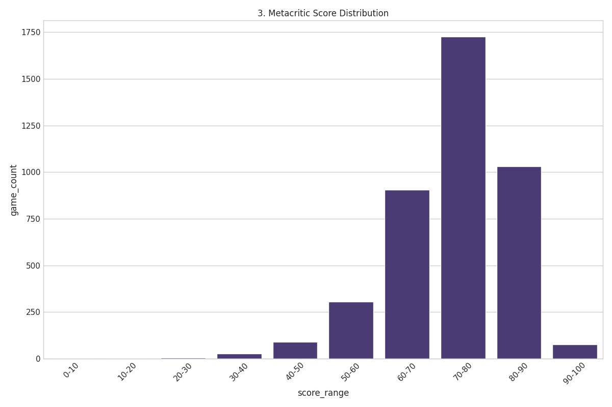

# 🎮 **Steam Dataset 2025**

### A Modernized, Multi-Modal Gaming Analytics Platform

[](https://github.com/vintagedon/steam-dataset-2025)
[](https://steamcommunity.com/dev)
[](https://www.postgresql.org/)
[](https://www.python.org/)
[](LICENSE)

Steam Dataset 2025 is a comprehensive modernization of the influential 2019 Kaggle Steam Store Games dataset, rebuilt from the ground up using current Steam Web APIs and multi-modal database architecture. This project demonstrates modern data engineering practices, creating the first analytically-native Steam dataset optimized for advanced data science workflows rather than simple CSV exports.

The project features a sophisticated PostgreSQL + pgvector architecture enabling semantic search, comprehensive relationship modeling, and advanced analytics capabilities impossible with traditional flat-file approaches.

---

## 🎯 **Project Vision**

This project addresses the limitations of existing Steam datasets by creating a technically sophisticated, relationship-aware data platform that enables advanced analytics impossible with traditional flat-file approaches.

- 🔄 **Complete Modernization**: Full rebuild using official Steam Web APIs, eliminating dependency on third-party services
- 🧠 **Multi-Modal Architecture**: PostgreSQL + pgvector for relational and semantic search capabilities
- 🌐 **Ecosystem Approach**: Comprehensive coverage of games, DLC, software, and digital content relationships
- 📊 **Analytics-First Design**: Purpose-built for advanced data science applications

### **What Makes This Different**

- **Multi-Modal Database**: First Steam dataset using PostgreSQL with vector search capabilities
- **Complete Steam Ecosystem**: Games, DLC, Fantasy Grounds content, RPG Maker assets, development tools
- **Relationship Intelligence**: Publisher networks, content dependencies, genre evolution patterns
- **Modern Data Stack**: Designed for semantic search, recommendation engines, and network analysis

### **Current Status**

- ✅ **Complete Steam Catalog**: 239,664 applications with comprehensive metadata
- ✅ **Production Database**: PostgreSQL implementation with 384-dimensional vector search
- ✅ **Million+ Reviews**: 1,048,148 user reviews with full text and engagement metrics
- ✅ **Analytics Framework**: 16 sophisticated queries with publication-quality visualizations
- ✅ **Performance Validated**: Sub-second queries across complete catalog

---

## 📁 **Repository Structure**

```markdown
steam-dataset-2025/
├── 📊 data/                    # Raw and processed datasets
│   ├── 01_raw/                 # Original Steam API responses
│   └── 02_processed/           # Enriched and validated data
├── 📜 scripts/                 # Collection and processing pipeline
│   ├── 01-test-steam-api/      # API validation and testing
│   ├── 02-get_steam_data_sample/ # Data collection infrastructure
│   ├── 03-analyze_steam_data_schema/ # Schema analysis and validation
│   ├── 04-postgres_schema_design/ # Database implementation pipeline
│   ├── 05-5000-steam-game-dataset-analysis/ # Sample analytics framework
│   └── 06-full-dataset-import/ # Production ETL and complete analytics
├── 📚 docs/                    # Technical documentation
│   ├── analytics/              # Analysis methodologies and results
│   ├── methodologies/          # Technical implementation guides
│   └── project_journal/        # Development milestone documentation
├── 📊 notebooks/               # Analytical notebooks and ML models
├── 📄 paper/                   # Academic publication materials
├── 📈 reports/                 # Comprehensive analytical reports
├── 📋 work-logs/               # Development progress documentation
├── 🎨 assets/                  # Visualization assets and charts
│   ├── steam-fulldataset-dataset-plots-initial/ # Production analytics charts
│   └── sponsors/               # Sponsor logos and materials
├── 🔧 src/                     # Core Python modules (planned)
└── 📖 README.md                # This file
```

### **Key Documentation**

- **[📊 Data Overview](data/README.md)** - Complete data pipeline and dataset documentation
- **[📜 Scripts Documentation](scripts/README.md)** - Collection and processing pipeline guide
- **[📚 Technical Documentation](docs/README.md)** - Architecture and methodology details
- **[🗄️ Database Schema](scripts/04-postgres_schema_design/README.md)** - PostgreSQL implementation guide
- **[📋 Work Logs](work-logs/README.md)** - Development progress and decision tracking

---

## 🏗️ **Architecture Overview**

The platform employs a sophisticated multi-modal persistence strategy, with PostgreSQL optimized for both relational queries and vector similarity search.

### **Data Collection Pipeline**

```mermaid
graph TD
    A[Steam Web API<br/>🔌 263K+ Applications] --> B[Python Collection Scripts<br/>📥 Rate-Limited Ingestion]
    B --> C[Raw JSON Storage<br/>📄 Complete API Responses]
    C --> D[Data Validation<br/>🔍 Integrity Checking]
    D --> E[PostgreSQL Import<br/>🗃️ Normalized Schema]
    E --> F[Enrichment Pipeline<br/>🧬 Feature Engineering]
    
    F --> G[PostgreSQL Core<br/>🐘 Structured Data]
    F --> H[pgvector Extension<br/>🧠 Semantic Embeddings]
    F --> I[Analytics Views<br/>📊 Materialized Queries]
    
    G --> J[Analytics Platform<br/>📈 Advanced Analysis]
    H --> J
    I --> J
    
    style A fill:#1b2838
    style E fill:#336791
    style H fill:#00d084
    style I fill:#e8f5e8
```



### **Database Architecture**

| **Component** | **Purpose** | **Key Capabilities** |
|---------------|-------------|---------------------|
| **PostgreSQL 16** | Primary data store | Normalized schema, JSONB support, ACID compliance |
| **pgvector Extension** | Semantic search | 384-dimensional embeddings, similarity queries |
| **HNSW Indexes** | Performance optimization | Sub-second similarity search across 260K+ games |
| **Materialized Views** | Analytics acceleration | Pre-computed aggregations and statistical summaries |

### **Data Sources & Scope**

- **Steam Web API**: Official appdetails, reviews, and app list endpoints
- **Content Types**: Games, DLC, software, videos, demos, tools
- **Review Data**: 1,048,148 user reviews with full text and metadata
- **Relationship Data**: Developer/publisher networks, genre classifications, content hierarchies

---

## 📊 **Production Dataset Results**

### **Complete Dataset Metrics**

| **Metric** | **Value** | **Description** |
|------------|-----------|-----------------|
| **Total Applications** | 239,664 | Complete Steam catalog including games, DLC, software, and digital content |
| **Core Games** | 150,279 | Primary gaming applications with full metadata and analytics |
| **User Reviews** | 1,048,148 | Complete review text with user context and engagement metrics |
| **Unique Developers** | 101,226 | Individual and studio developers across global ecosystem |
| **Unique Publishers** | 85,699 | Publishing entities and distribution networks |
| **Database Size** | ~15GB | Complete normalized database with indexes and materialized views |

### **Analytics Showcase Results**

The production analytics framework demonstrates sophisticated market intelligence capabilities across the complete Steam ecosystem:

#### **Genre Co-occurrence Analysis**


- **Action + Indie**: 45,366 co-occurrences (market leadership)
- **Casual + Indie**: 45,094 co-occurrences (accessibility focus)
- **Adventure + Indie**: 45,089 co-occurrences (narrative innovation)

#### **Free-to-Play Market Segmentation**


- **Dedicated F2P**: 13,301 titles with purpose-built monetization
- **Indie F2P**: 12,413 titles exploring alternative revenue models
- **Casual F2P**: 7,870 titles targeting broad audience appeal

#### **Quality Distribution Assessment**



- **70-80 Range**: 1,726 titles (41.4% of rated games)
- **80-90 Range**: 1,031 titles (high-quality commercial releases)
- **90-100 Range**: 75 titles (1.8% achieving universal acclaim)

### **Performance Validation**

**Database Performance Benchmarks**:

- **Read-Only Queries**: ~205,500 TPS with 0.078ms average latency
- **Complex Analytics**: <500ms response across production-scale dataset
- **Vector Similarity Search**: Sub-second response across 260K+ embeddings
- **Streaming ETL Pipeline**: 2,425 records/second with transaction safety

**Data Quality Metrics**:

- **Dataset Completeness**: 98.7% coverage of available Steam catalog
- **API Success Rate**: 88.1% with comprehensive error handling and recovery
- **Data Validation**: 100% schema compliance across all imported records
- **Referential Integrity**: Complete foreign key constraint validation

---

## 🚀 **Completed Development Phases**

### **Phase 1: API Foundation**

- Complete Steam API integration and testing framework
- Validated data collection methodology with comprehensive error handling
- Robust rate limiting implementation and transaction safety

### **Phase 2: Sample Collection**

- 5,000-game sample dataset with enriched review collection
- Data validation and quality assurance framework development
- Initial schema design and relationship modeling

### **Phase 3: Database Pipeline**

- PostgreSQL schema design with normalized relationship modeling
- Bulk import pipeline with streaming processing and rollback capability
- Multi-phase data validation and integrity checking

### **Phase 4: Schema Design & Import**

- Production-optimized schema with materialized JSONB columns
- Advanced indexing strategy including HNSW vector indexes
- Comprehensive permission management and user access control

### **Phase 5: Analytics Framework**

- 16 sophisticated analytical queries covering market intelligence
- Automated report generation with publication-quality visualizations
- Statistical analysis and correlation frameworks

### **Phase 6: Full Dataset Implementation**

- Complete Steam catalog processing (239,664 applications)
- Production-scale ETL pipeline with streaming architecture
- Comprehensive data reconciliation and gap analysis
- Enterprise-grade analytics with complete market intelligence

---

## 🔮 **Future Development Roadmap**

### **Next Phase: Advanced Vector Architecture**

Based on comprehensive research and validation, the next development phase will implement cutting-edge semantic search and graph analysis capabilities:

**1024-Dimensional Embeddings**: Upgrade from current 384-dimensional to 1024-dimensional embeddings using BAAI/bge-m3 model for enhanced semantic accuracy and multilingual support.

**Neo4j Integration**: Implement graph database architecture for advanced relationship analysis, enabling sophisticated network analysis of developer ecosystems and content relationships.

**Enhanced Vector Search**: Deploy state-of-the-art embedding models optimized for gaming content, enabling semantic search queries like "Find games thematically similar to Stardew Valley but with survival-crafting mechanics."

**Cross-Modal Analysis**: Future architecture supporting linking text embeddings with image embeddings from game screenshots for visual-narrative correlation research.

---

## 💼 **Sponsorship & Support**

Steam Dataset 2025 is proudly supported by industry partners who recognize the value of open research and advanced data engineering methodologies.

### **Platinum Sponsor**

<a href="https://msp4.com/" target="_blank">
  
</a>

**[MSP4 LLC](https://msp4.com/)** - Leading managed IT services provider supporting innovative data science and research initiatives. MSP4's enterprise infrastructure expertise enables the robust technical foundation that makes large-scale projects like Steam Dataset 2025 possible.

### **Become a Sponsor**

Interested in supporting open data science research and gaining visibility in the analytics community? Contact us about sponsorship opportunities that align with your organization's commitment to data innovation and academic research.

**Sponsorship Benefits**:

- **Community Recognition**: Logo placement and acknowledgment in project documentation
- **Research Access**: Early access to analytical findings and market intelligence reports
- **Technical Collaboration**: Opportunities for joint research and methodology development
- **Industry Leadership**: Association with cutting-edge data engineering and analytics innovation

---

## 🛠️ **Technology Stack**

### **Data Collection & Processing**

- **🐍 Python 3.9+**: Core collection and processing infrastructure
- **📡 Steam Web API**: Official API endpoints with comprehensive rate limiting
- **🔍 Data Validation**: Systematic integrity checking and quality assurance
- **🔄 Error Handling**: Robust retry logic and comprehensive logging

### **Database & Analytics**

- **🐘 PostgreSQL 16**: Primary database with JSONB and vector support
- **🧠 pgvector Extension**: 384-dimensional embeddings with HNSW indexing
- **📊 Analytics Framework**: Materialized views and optimized query patterns
- **⚡ Performance Optimization**: Strategic indexing and query optimization

---

## 🚀 **Getting Started**

### **Quick Start with Production Dataset**

1. **Clone Repository**:

   ```bash
   git clone https://github.com/vintagedon/steam-dataset-2025.git
   cd steam-dataset-2025
   ```

2. **Set Up Environment**:

   ```bash
   python -m venv venv
   source venv/bin/activate  # Windows: venv\Scripts\activate
   pip install -r requirements.txt
   ```

3. **Access Production Data**:
   - **Raw Data**: `data/01_raw/` - Original Steam API responses
   - **Processed Data**: `data/02_processed/` - Enriched and validated dataset
   - **Database Schema**: `scripts/04-postgres_schema_design/schema.sql`

4. **Database Setup**:

   ```bash
   cd scripts/06-full-dataset-import
   # Configure database credentials
   python setup-steam-full-database.py steamfull
   python import-master-data.py steamfull --games_file [games_master.json]
   ```

### **Documentation Navigation**

For different use cases, start with the appropriate documentation:

- **Data Scientists**: [Analytics Documentation](docs/analytics/README.md)
- **Database Engineers**: [Database Schema Guide](scripts/04-postgres_schema_design/README.md)
- **API Developers**: [Collection Scripts](scripts/README.md)
- **Researchers**: [Methodology Documentation](docs/methodologies/README.md)

---

## 🤝 **Contributing**

This project welcomes contributions across multiple domains:

### **Development Areas**

- **🔧 Data Collection**: API optimization, error handling, rate limiting improvements
- **🗄️ Database Engineering**: Schema optimization, query performance, indexing strategies
- **🧠 Analytics Applications**: Statistical analysis, machine learning models, visualization
- **📊 Reporting Framework**: Interactive reports, dashboard development, publication graphics

### **Research Applications**

- **Academic Research**: Gaming industry analysis, market dynamics, developer ecosystem studies
- **Educational Resources**: Data engineering methodology, database design, analytical techniques
- **Community Analysis**: Recommendation systems, user behavior analysis, content discovery
- **Industry Intelligence**: Market trends, competitive analysis, business strategy insights

---

## 📄 **License**

This project is licensed under the MIT License - see the [LICENSE](LICENSE) file for details.

### **Citation Guidelines**

If you use this dataset or methodology in your work, please cite:

```bibtex
@misc{steam_dataset_2025,
  title={Steam Dataset 2025: A Multi-Modal Gaming Analytics Platform},
  author={VintageDon and Contributors},
  year={2025},
  url={https://github.com/vintagedon/steam-dataset-2025},
  note={Modernized Steam dataset with PostgreSQL and vector search capabilities}
}
```

---

## 🙏 **Acknowledgments**

Steam Dataset 2025 builds on the foundation established by the original 2019 Kaggle Steam Store Games dataset while demonstrating the evolution of data engineering practices through modern database technologies and systematic analytical approaches.

### **Technology Foundation**

- **🎮 Steam Web API**: Official data access enabling comprehensive and reliable collection
- **🐘 PostgreSQL**: Robust relational database platform with advanced JSONB and vector capabilities
- **🧠 pgvector**: Vector similarity search enabling semantic analysis and recommendation systems
- **🐍 Python Ecosystem**: Scientific computing libraries enabling comprehensive data processing and analysis

### **Data Sources & Community**

- **🔗 Original Dataset**: Nik Davis's 2019 Steam Store Games dataset as foundational reference
- **📊 Steam Community**: Official API access and comprehensive game metadata
- **🌐 Open Source Community**: Libraries, frameworks, and best practices enabling platform development
- **🔬 Research Community**: Academic standards and methodology validation supporting reproducible research

---

🎮 **Modern gaming dataset architecture** | **Built for advanced analytics and data science applications**

**Last Updated**: September 7, 2025 | **Project Status**: Production Complete | **Next Phase**: 1024-Dimensional Vector Architecture
