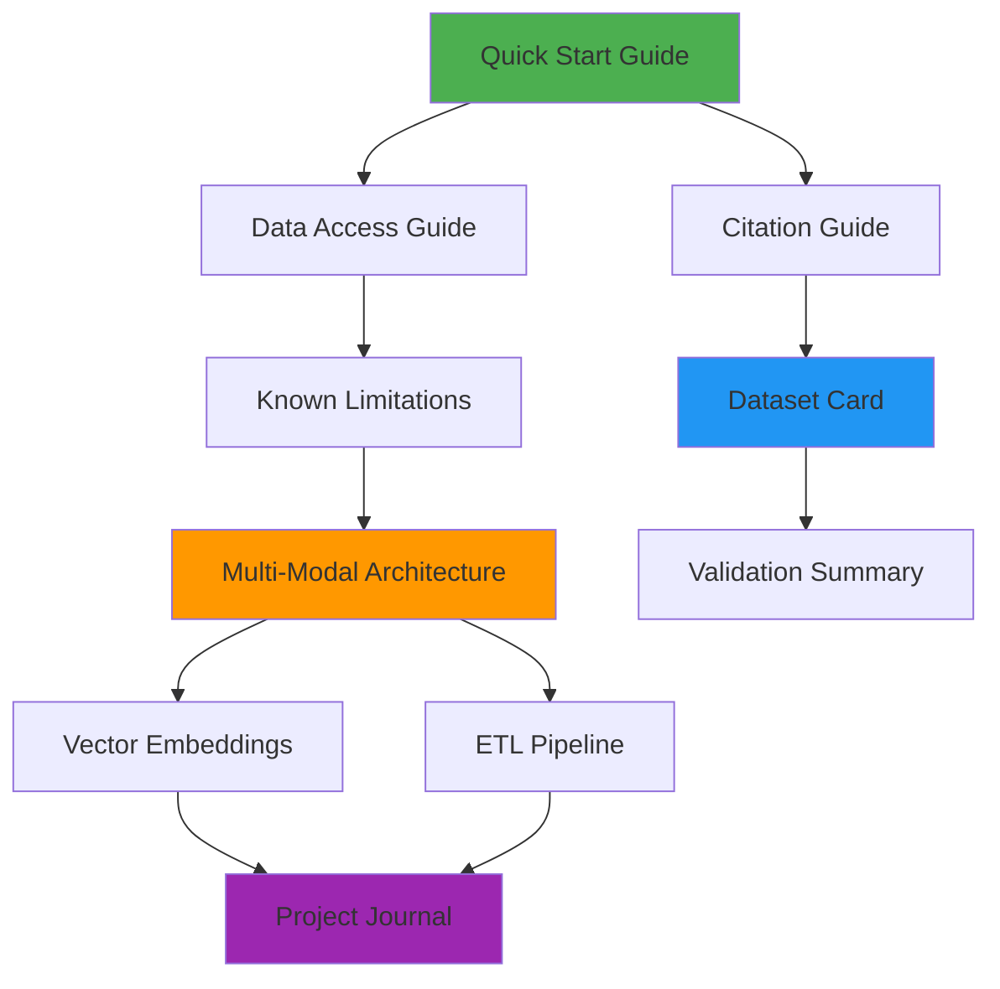

# 📚 Steam Dataset 2025: Documentation Hub

Welcome to the comprehensive documentation suite for Steam Dataset 2025. This documentation provides everything needed to understand, use, and contribute to the largest and most methodologically rigorous Steam dataset for academic research.

---

## 🎯 Documentation Overview

This documentation suite serves researchers, data scientists, and developers with varying levels of expertise, from quick evaluation through advanced academic applications. All documentation follows established academic standards and prioritizes transparency and reproducibility.

### Documentation Philosophy

- 📊 Academic Rigor: All methodologies documented for peer review and reproducibility
- 🚀 User-Centered: Clear navigation from beginner through expert applications
- 🔍 Transparent: Complete disclosure of limitations, biases, and methodological choices
- ♻️ Reproducible: Step-by-step procedures enabling independent validation

---

## 🗂️ Documentation Structure

### 🚀 Getting Started (Essential Reading)

Perfect for new users and quick evaluation of the dataset's capabilities.

| Document | Purpose | Time Required | Audience |
|--------------|-------------|------------------|--------------|
| [Quick Start Guide](quick-start.md) | From download to first analysis in 30 minutes | 30 min | All users |
| [Data Access Guide](data-access.md) | File locations, sizes, and download procedures | 15 min | Data consumers |
| [Citation Guide](citation.md) | Academic attribution and licensing terms | 10 min | Academic users |
| [Known Limitations](limitations.md) | Transparent constraints and bias documentation | 20 min | Researchers |

### 🔬 Technical Methodologies (In-Depth Analysis)

Comprehensive technical documentation for understanding and reproducing the dataset's creation process.

| Document | Focus Area | Audience | Technical Level |
|--------------|----------------|--------------|-------------------|
| [Multi-Modal Architecture](methodologies/multi-modal-architecture.md) | PostgreSQL + JSONB + Vector database design | Database architects, ML engineers | Advanced |
| [Vector Embeddings Methodology](methodologies/vector-embeddings.md) | BGE-M3 implementation and reproducibility | ML researchers, data scientists | Advanced |
| [ETL Pipeline Documentation](methodologies/etl-pipeline.md) | Complete data processing methodology | Data engineers | Intermediate |

### 🎓 Academic Materials (Peer Review Ready)

Academic-standard documentation following established frameworks for transparent dataset publication.

| Document | Standard/Framework | Purpose | Audience |
|--------------|----------------------|-------------|--------------|
| [Dataset Card](../paper/dataset-card.md) | Gebru et al. (2021) Datasheets | Complete academic transparency | Academic reviewers |
| [Validation Summary](../paper/validation-summary.md) | Competitive positioning | Academic literature positioning | Peer reviewers |

### 📋 Development History (Process Transparency)

Complete development provenance for understanding decision-making process and methodology evolution.

| Resource | Content | Value |
|--------------|-------------|-----------|
| [Project Journal Index](project_journal/README.md) | Phase-by-phase development documentation | Understanding methodology evolution |
| [Work Logs](../work-logs/) | Session-by-session technical decisions | Implementation details and challenges |

---

## 🧭 Navigation by User Type

### 🎓 Academic Researchers

Primary Path for Academic Use:

1. [Dataset Card](../paper/dataset-card.md) - Complete academic datasheet following Gebru et al. standards
2. [Citation Guide](citation.md) - Proper attribution for publications  
3. [Known Limitations](limitations.md) - Transparent bias and constraint documentation
4. [Validation Summary](../paper/validation-summary.md) - Competitive positioning and contributions

Methodology Deep Dive:

- [Multi-Modal Architecture](methodologies/multi-modal-architecture.md) - Technical innovation justification
- [Vector Embeddings](methodologies/vector-embeddings.md) - ML implementation reproducibility
- [Project Journal](project_journal/README.md) - Development process transparency

### 📊 Data Scientists & Analysts

Quick Start Path:

1. [Quick Start Guide](quick-start.md) - 30-minute setup to first insights
2. [Data Access Guide](data-access.md) - Sample data and full dataset access
3. [Known Limitations](limitations.md) - Understanding data constraints

Advanced Applications:

- [Multi-Modal Architecture](methodologies/multi-modal-architecture.md) - Database capabilities and query patterns
- [Vector Embeddings](methodologies/vector-embeddings.md) - Semantic search implementation

### 🏗️ Technical Implementers

Implementation Path:

1. [Multi-Modal Architecture](methodologies/multi-modal-architecture.md) - Complete technical architecture
2. [ETL Pipeline Documentation](methodologies/etl-pipeline.md) - Processing methodology
3. [Vector Embeddings](methodologies/vector-embeddings.md) - ML infrastructure setup

Reproducibility Resources:

- [Data Access Guide](data-access.md) - Complete file specifications
- [Project Journal](project_journal/README.md) - Technical decision history

### 🎮 Gaming Industry Professionals

Business Intelligence Path:

1. [Quick Start Guide](quick-start.md) - Immediate access to insights
2. [Known Limitations](limitations.md) - Understanding data scope
3. [Data Access Guide](data-access.md) - Accessing complete dataset

Market Analysis Applications:

- Publisher network analysis capabilities
- Genre trend identification
- Competitive positioning insights

### 📚 Students & Educators

Learning Path:

1. [Quick Start Guide](quick-start.md) - Hands-on introduction
2. [Project Journal](project_journal/README.md) - Learn from development process
3. [Multi-Modal Architecture](methodologies/multi-modal-architecture.md) - Modern database techniques

Educational Value:

- AI-assisted data engineering methodology (RAVGV framework)
- Multi-modal database architecture examples
- Academic reproducibility standards

---

## 📖 Document Relationships

Understanding how different documents connect helps navigate the documentation efficiently based on your specific needs.

### Document Dependencies

- 🚀 Entry Points: Quick Start, Data Access, Citation (no prerequisites)
- 🔍 Analysis Ready: Limitations (requires Data Access understanding)
- 🏗️ Technical Deep Dive: Architecture docs (requires basic understanding)
- 🎓 Academic Use: Dataset Card (comprehensive, references all methodologies)

---

## 🔍 Finding Specific Information

### Common Questions & Where to Find Answers

| Question | Primary Document | Additional Resources |
|--------------|---------------------|-------------------------|
| How do I get started quickly? | [Quick Start Guide](quick-start.md) | [Data Access Guide](data-access.md) |
| How do I cite this dataset? | [Citation Guide](citation.md) | [Dataset Card](../paper/dataset-card.md) |
| What are the data limitations? | [Known Limitations](limitations.md) | [Dataset Card](../paper/dataset-card.md) |
| How was the data collected? | [ETL Pipeline](methodologies/etl-pipeline.md) | [Project Journal](project_journal/README.md) |
| What makes this dataset unique? | [Validation Summary](../paper/validation-summary.md) | [Multi-Modal Architecture](methodologies/multi-modal-architecture.md) |
| How do I implement semantic search? | [Vector Embeddings](methodologies/vector-embeddings.md) | [Multi-Modal Architecture](methodologies/multi-modal-architecture.md) |
| Where do I download the data? | [Data Access Guide](data-access.md) | [Quick Start Guide](quick-start.md) |
| Is this academically rigorous? | [Dataset Card](../paper/dataset-card.md) | [Validation Summary](../paper/validation-summary.md) |

### Technical Implementation Questions

| Implementation Need | Primary Resource | Supporting Materials |
|------------------------|---------------------|-------------------------|
| Database schema setup | [Multi-Modal Architecture](methodologies/multi-modal-architecture.md) | [ETL Pipeline](methodologies/etl-pipeline.md) |
| Vector search implementation | [Vector Embeddings](methodologies/vector-embeddings.md) | [Multi-Modal Architecture](methodologies/multi-modal-architecture.md) |
| Data processing pipeline | [ETL Pipeline](methodologies/etl-pipeline.md) | [Project Journal](project_journal/README.md) |
| Reproducibility validation | [Dataset Card](../paper/dataset-card.md) | All methodology documents |

---

## 🛠️ Documentation Standards

### Quality Assurance

All documentation follows established academic and technical writing standards:

- 📋 Template Compliance: Consistent structure using project documentation standards
- 🔗 Accurate Linking: All internal references verified against current repository structure
- 📊 Evidence-Based: All claims supported by empirical data or documented procedures
- ♻️ Reproducibility: Complete procedures for independent validation
- 🎯 User-Focused: Content prioritizes practical applicability over theoretical completeness

### Maintenance & Updates

- 🔄 Version Control: All documents maintained in git with complete change history
- 📈 Continuous Improvement: Regular updates based on user feedback and community contributions
- 🎯 Accuracy Verification: Technical specifications validated against actual implementation
- 📋 Cross-Reference Integrity: Link validation and consistency checking

---

## 🤝 Contributing to Documentation

### Improvement Opportunities

- 📝 Usage Examples: Additional analysis examples and tutorials
- 🔧 Implementation Guides: Platform-specific setup instructions
- 🌍 Translation: Multi-language documentation for global accessibility
- 📊 Case Studies: Real-world application examples and results

### Contribution Process

1. 🐛 Issue Identification: Report documentation gaps or unclear sections
2. 💡 Improvement Proposals: Suggest enhancements through GitHub issues
3. 📝 Content Contributions: Submit pull requests with documentation improvements
4. 🎯 Review Process: Community review and maintainer approval

### Documentation Standards for Contributors

- Follow established templates and structure patterns
- Maintain academic rigor and evidence-based claims
- Include practical examples and clear explanations
- Verify all technical information against current implementation

---

## 📞 Getting Help

### Support Channels

- 🐛 GitHub Issues: [Technical questions and bug reports](https://github.com/VintageDon/steam-dataset-2025/issues)
- 📧 Direct Contact: VintageDon ([GitHub Profile](https://github.com/VintageDon))
- 🆔 Academic Contact: ORCID [0009-0008-7695-4093](https://orcid.org/0009-0008-7695-4093)

### Response Expectations

- 🚀 Quick Questions: Check existing documentation first - most answers are already available
- 🔧 Technical Issues: Use GitHub issues with specific error information and context
- 🎓 Academic Inquiries: Reference specific documentation sections for focused discussion
- 💡 Enhancement Requests: Provide clear use cases and implementation suggestions

---

Document Information

| Field | Value |
|-----------|-----------|
| Author | VintageDon - [GitHub](https://github.com/VintageDon) |
| Created | 2025-09-07 |
| Last Updated | 2025-09-07 |
| Version | 2.0 |

---
*Tags: documentation-hub, steam-dataset, academic-research, multi-modal-database, gaming-analytics*
