# 🔬 Steam Dataset 2025: Technical Methodologies

This directory contains comprehensive technical documentation of the methodologies, architectural decisions, and implementation strategies that underpin Steam Dataset 2025. These documents provide the systematic foundation for understanding, reproducing, and extending the dataset's creation process.

---

## 📋 Methodologies Overview

The Steam Dataset 2025 methodologies represent a systematic approach to modern data engineering, combining academic rigor with practical implementation. Each methodology document follows established academic standards while providing actionable implementation guidance.

### Methodological Principles

- 🔬 Academic Rigor: All decisions documented with empirical justification
- ♻️ Full Reproducibility: Complete procedures enabling independent validation
- 🏗️ Scalable Architecture: Designed for production deployment and extension
- 🌍 Global Applicability: Methodologies adaptable to other gaming platforms and domains

---

## 🗂️ Directory Contents

This section provides systematic navigation to all methodology documentation within the Steam Dataset 2025 technical framework.

### Core Methodology Documents

| Document | Focus Area | Technical Level | Audience |
|--------------|----------------|-------------------|--------------|
| [Multi-Modal Database Architecture](multi-modal-architecture.md) | PostgreSQL + JSONB + Vector hybrid design | Advanced | Database architects, ML engineers |
| [Vector Embeddings Methodology](vector-embeddings.md) | BGE-M3 implementation and reproducibility | Advanced | ML researchers, data scientists |
| [ETL Pipeline Documentation](etl-pipeline.md) | Complete data processing methodology | Intermediate | Data engineers, reproducibility researchers |
| [Data Validation and QA](data-validation-and-qa.md) | Quality assurance and validation procedures | Intermediate | Data quality engineers |

### Supporting Documentation

| Document | Purpose | Relationship |
|--------------|-------------|------------------|
| [Steam API Collection](steam-api-collection.md) | Official API usage methodology | Foundation for ETL pipeline |
| README.md | This navigation document | Methodologies hub |

---

## 🗂️ Methodology Structure

Visual representation of how the different methodologies interconnect to create the complete Steam Dataset 2025 system:

```mermaid
graph TD
    A[Steam API Collection] --> B[ETL Pipeline]
    B --> C[Multi-Modal Architecture]
    B --> D[Data Validation & QA]
    C --> E[Vector Embeddings]
    
    F[Academic Standards] --> A
    F --> B
    F --> C
    F --> D
    F --> E
    
    style A fill:#1b2838
    style C fill:#336791
    style E fill:#00d084
    style F fill:#4CAF50
```

### Methodology Dependencies

- 🏁 Foundation: Steam API Collection establishes data acquisition principles
- 🔄 Processing: ETL Pipeline transforms raw API responses into analytical data
- 🏗️ Architecture: Multi-Modal Database enables advanced analytical capabilities
- 🧠 Intelligence: Vector Embeddings add semantic search and ML capabilities
- ✅ Quality: Data Validation ensures academic standards and reproducibility

---

## 🧭 Navigation by Use Case

### 🏗️ Database Architects & System Designers

Primary Path:

1. [Multi-Modal Database Architecture](multi-modal-architecture.md) - Complete architectural framework
2. [ETL Pipeline Documentation](etl-pipeline.md) - Processing methodology and performance
3. [Data Validation and QA](data-validation-and-qa.md) - Quality assurance procedures

Key Questions Answered:

- Why choose PostgreSQL + JSONB + pgvector over alternatives?
- How does the hybrid architecture handle 239K+ applications efficiently?
- What are the performance characteristics and optimization strategies?
- How is data integrity maintained across multi-modal storage?

### 🧠 ML Engineers & Data Scientists

Primary Path:

1. [Vector Embeddings Methodology](vector-embeddings.md) - BGE-M3 implementation
2. [Multi-Modal Database Architecture](multi-modal-architecture.md) - Vector storage and querying
3. [ETL Pipeline Documentation](etl-pipeline.md) - Data preprocessing for ML

Key Questions Answered:

- How to implement BGE-M3 embeddings for semantic search?
- What are the infrastructure requirements for vector processing?
- How to optimize batch processing for large-scale embedding generation?
- How to integrate vector capabilities with traditional SQL queries?

### 🔧 Data Engineers & Pipeline Developers

Primary Path:

1. [ETL Pipeline Documentation](etl-pipeline.md) - Complete processing methodology
2. [Steam API Collection](steam-api-collection.md) - Data acquisition strategies
3. [Data Validation and QA](data-validation-and-qa.md) - Quality control procedures

Key Questions Answered:

- How to handle Steam API rate limiting and error recovery?
- What are the memory management strategies for processing 4.2GB datasets?
- How to implement robust error handling and data validation?
- How to ensure reproducible processing across different environments?

### 🎓 Academic Researchers & Reproducibility

Primary Path:

1. [Data Validation and QA](data-validation-and-qa.md) - Academic quality standards
2. [Vector Embeddings Methodology](vector-embeddings.md) - ML reproducibility procedures
3. [Multi-Modal Database Architecture](multi-modal-architecture.md) - Architectural validation

Key Questions Answered:

- How to reproduce the complete dataset creation process?
- What are the statistical properties and validation procedures?
- How to verify data integrity and processing accuracy?
- What are the academic standards and peer review preparations?

---

## 📊 Methodology Characteristics

### Technical Complexity Levels

| Methodology | Implementation Complexity | Academic Rigor | Production Readiness |
|-----------------|------------------------------|-------------------|-------------------------|
| Steam API Collection | Intermediate | High | Production |
| ETL Pipeline | Advanced | High | Production |
| Multi-Modal Architecture | Advanced | High | Production |
| Vector Embeddings | Advanced | High | Production |
| Data Validation | Intermediate | High | Production |

### Resource Requirements

| Methodology | Computational Requirements | Infrastructure Dependencies | Expertise Level |
|-----------------|-------------------------------|--------------------------------|-------------------|
| Steam API Collection | Minimal (rate-limited) | Internet connection, API key | Intermediate Python |
| ETL Pipeline | High (memory intensive) | 16GB+ RAM, NVMe SSD | Advanced data engineering |
| Multi-Modal Architecture | High (database intensive) | PostgreSQL 16+, pgvector | Advanced database administration |
| Vector Embeddings | Very High (GPU intensive) | NVIDIA GPU, 16GB+ VRAM | Advanced ML engineering |
| Data Validation | Moderate | Database access, Python env | Intermediate data analysis |

---

## 🔍 Implementation Guidance

### Sequential Implementation Path

For Complete System Reproduction:

1. 🚀 Start: [Steam API Collection](steam-api-collection.md) - Understand data acquisition
2. 🏗️ Foundation: [Multi-Modal Architecture](multi-modal-architecture.md) - Set up database infrastructure
3. 🔄 Processing: [ETL Pipeline Documentation](etl-pipeline.md) - Implement data processing
4. ✅ Validation: [Data Validation and QA](data-validation-and-qa.md) - Ensure quality standards
5. 🧠 Enhancement: [Vector Embeddings Methodology](vector-embeddings.md) - Add ML capabilities

For Specific Capabilities:

- Database Only: Architecture → ETL Pipeline → Validation
- ML Focus: Vector Embeddings → Architecture (vector components)
- Quality Assurance: Validation → ETL Pipeline → API Collection

### Key Decision Points

| Decision | Primary Methodology | Considerations |
|--------------|-------------------------|-------------------|
| Database technology selection | [Multi-Modal Architecture](multi-modal-architecture.md) | Performance, scalability, ML integration |
| Embedding model choice | [Vector Embeddings](vector-embeddings.md) | Multilingual support, dimensionality, performance |
| Processing pipeline design | [ETL Pipeline](etl-pipeline.md) | Memory efficiency, error handling, reproducibility |
| Quality standards implementation | [Data Validation](data-validation-and-qa.md) | Academic rigor, statistical validation |

---

## 📚 Academic Context & Validation

### Peer Review Preparation

Each methodology document includes comprehensive academic validation support:

- 📋 Complete Methodology Documentation: All procedures documented for peer review
- 📊 Empirical Validation: Performance metrics and statistical validation
- ♻️ Reproducibility Procedures: Step-by-step reproduction instructions
- 🎯 Comparative Analysis: Positioning against existing approaches and alternatives

### Academic Standards Compliance

| Standard | Implementation | Documentation |
|--------------|-------------------|-------------------|
| Transparency | Complete methodology disclosure | All methodology documents |
| Reproducibility | Step-by-step procedures | ETL Pipeline, Vector Embeddings |
| Validation | Statistical and empirical testing | Data Validation and QA |
| Peer Review | Academic-standard documentation | Multi-Modal Architecture |

### Research Contributions

Methodological Innovations:

- 🏗️ Multi-Modal Integration: First gaming dataset with hybrid relational+document+vector architecture
- 🌍 Multilingual Embeddings: Systematic application of BGE-M3 for global gaming content
- 🔄 API-Pure Collection: Methodology ensuring data integrity through official APIs only
- 📊 Academic Transparency: Complete methodology documentation following established standards

---

## 🔧 Troubleshooting & Support

### Common Implementation Challenges

| Challenge | Primary Resource | Additional Support |
|---------------|---------------------|----------------------|
| Database performance optimization | [Multi-Modal Architecture](multi-modal-architecture.md) | Performance tuning section |
| Memory management during processing | [ETL Pipeline](etl-pipeline.md) | Memory optimization strategies |
| GPU/embedding infrastructure setup | [Vector Embeddings](vector-embeddings.md) | Infrastructure requirements |
| Data quality validation failures | [Data Validation](data-validation-and-qa.md) | Troubleshooting procedures |

### Getting Technical Support

- 🐛 Implementation Issues: [GitHub Issues](https://github.com/VintageDon/steam-dataset-2025/issues) with specific methodology and error details
- 📧 Methodology Questions: Reference specific methodology sections for focused discussion
- 🎓 Academic Inquiries: Include methodology validation questions and peer review requirements
- 🏗️ Architecture Decisions: Provide use case context and performance requirements

---

## 🤝 Contributing to Methodologies

### Enhancement Opportunities

- 🔧 Implementation Guides: Platform-specific setup instructions and optimization tips
- 📊 Performance Benchmarks: Additional infrastructure configurations and performance data
- 🌍 Alternative Implementations: Different technology stacks and architectural approaches
- 📚 Educational Materials: Tutorials and learning paths for methodology implementation

### Contribution Standards

- 📋 Academic Rigor: All methodology changes must include empirical validation
- ♻️ Reproducibility: Complete procedures and infrastructure requirements
- 📊 Performance Impact: Benchmark results and comparative analysis
- 📚 Documentation Quality: Clear explanations and practical implementation guidance

---

Document Information

| Field | Value |
|-----------|-----------|
| Author | VintageDon - [GitHub](https://github.com/VintageDon) |
| Created | 2025-09-07 |
| Last Updated | 2025-09-07 |
| Version | 2.0 |

---
*Tags: technical-methodology, multi-modal-database, vector-embeddings, etl-pipeline, academic-standards*
