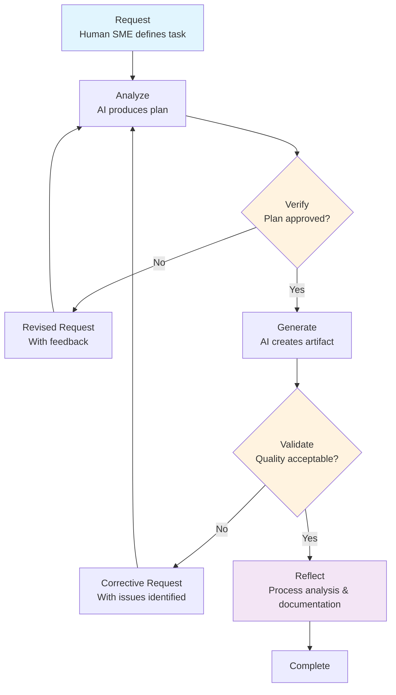

# TRACE Framework: Transparent, Reproducible, Audited Co-creation Engine

---
Document Type: Methodology Reference  
Version: 3.2  
Last Updated: September 8, 2025  
Status: Production Framework  
Classification: Public Research  
---

## Overview

TRACE (Transparent, Reproducible, Audited Co-creation Engine) is a structured framework for systematic human-AI collaboration in high-stakes knowledge work. Originally developed through intensive multi-model collaborative sessions, TRACE provides a verifiable, auditable approach to semantic artifact co-creation that maintains expert oversight while leveraging AI capabilities for complex analytical tasks.

The framework employs praxatic scaffolding - systematic procedural frameworks that guide knowledge creation through structured cognitive rituals, ensuring quality and reproducibility in complex collaborative environments.

## Core Methodology: RAVGVR Process

TRACE transforms ad-hoc AI interactions into a systematic cognitive ritual through the RAVGVR (Request-Analyze-Verify-Generate-Validate-Reflect) process specification:

1. Request (R) - Human SME formulates strategic directive defining goal, scope, and context  
2. Analyze (A) - AI system processes request and produces intermediate analytical artifact  
3. Verify (V1) - Pre-generation validation ensuring semantic alignment before expensive computation  
4. Generate (G) - AI executes approved plan to create target knowledge artifact  
5. Validate (V2) - Post-generation quality assurance confirming accuracy and completeness  
6. Reflect (R) - Systematic analysis of process and outcomes for continuous improvement  

## Key Innovation: Dual-Validation Architecture

TRACE's primary innovation lies in its dual-validation loop structure that bifurcates human oversight into two purposive stages:

- V1 (Verify): Strategic alignment check preventing wasted effort on flawed generation paths
- V2 (Validate): Traditional quality assurance ensuring artifact fidelity and accuracy

This cognitive scaffolding approach optimizes expert cognitive load while maintaining rigorous quality control throughout the knowledge creation process.

## Theoretical Foundation

TRACE is grounded in Distributed Cognition theory and Hybrid Intelligence principles, addressing the critical challenge of "hybrid agent opacity" in human-AI teams. The structured transparency of the Verify stage transforms opaque AI collaboration into a "glass-box" partnership where expert judgment remains central to all critical decisions.

## Implementation Framework

TRACE integrates with modern development practices through:

- Git-Native Orchestration: Leveraging Issues and Pull Requests as workflow state machines
- Spec-Driven Development: Systematic specification creation and validation
- Multi-Modal Documentation: Comprehensive capture of process and outcomes
- Performance Metrics: VVR (Verify-Validate Ratio), FPMR (First-Pass Match Rate), COI (Cognitive Overhead Index)

## Applications and Use Cases

TRACE excels in domains requiring verifiable semantic artifact co-creation:

- Enterprise Documentation: Technical specifications, compliance reports, policy development
- Research and Analysis: Literature reviews, data analysis, methodology development  
- Infrastructure Management: Configuration specifications, deployment procedures, security protocols
- Academic Publishing: Dataset creation, methodology documentation, reproducible research

Current Implementation Context: The framework is actively deployed in IT/DevOps environments where structured workflows are inherent to the domain. This structured foundation provides ideal conditions for TRACE implementation, as the systematic nature of infrastructure management aligns naturally with the framework's cognitive scaffolding requirements.

## Validation and Evidence

TRACE has demonstrated significant productivity gains while maintaining quality standards:

- Empirical Validation: Steam Dataset 2025 project (239K+ applications, 20 hours development time)
- Academic Standards: Publication-ready documentation and reproducible methodologies
- Enterprise Readiness: Production-grade infrastructure and compliance frameworks
- Systematic Transparency: Complete process documentation enabling reproducibility

## Framework Evolution

TRACE represents ongoing research in human-AI collaboration with clear evolution paths:

- Current State: Proven methodology for structured knowledge co-creation with transparent validation loops
- Integration: Synthesis with Spec-as-Code and structured prompting frameworks  
- Explainable AI Integration: Early-stage research into incorporating xAI techniques (SHAP, LIME) for enhanced transparency and "glassiness" in AI decision-making processes, anticipating future regulatory requirements for AI explainability in high-stakes domains
- Future Vision: Self-documenting systems with integrated explainability, where documentation becomes a core operational principle driving systematic knowledge capture, process improvement, and regulatory compliance
- Research Platform: "Laboratory in the wild" for studying human-AI interaction dynamics

## Implementation Guidance

Organizations implementing TRACE should focus on:

1. SME Identification: The framework requires Subject Matter Experts with domain expertise and systems thinking. The Deep SME concept represents an advanced form where experts are positioned at the intersection of two unrelated fields, creating a nexus of overlapping competencies that enables unique insights. Example: The Proxmox Astronomy Lab enterprise platform emerged from the intersection of systems engineering expertise with citizen science astronomy, creating novel capabilities for scientific computing infrastructure that neither domain could achieve independently.

2. Process Discipline: Maintaining structured workflows and validation checkpoints through praxatic scaffolding

3. Documentation Culture: Systematic capture of work logs, decisions, and outcomes for semantic artifact co-creation

4. Continuous Improvement: Regular reflection and methodology refinement

5. Tool Integration: Leveraging appropriate technical infrastructure for workflow support

Domain Suitability: TRACE performs optimally in structured environments where systematic approaches are valued. IT/DevOps contexts provide ideal implementation conditions due to their inherent procedural frameworks and quality control requirements.

## Research and Publication

TRACE supports academic research through:

- Methodological Transparency: Complete process documentation for reproducibility
- Performance Metrics: Quantitative measurement of collaborative effectiveness  
- Comparative Analysis: Systematic evaluation against alternative approaches
- Open Science: Public availability of frameworks and validation data

---

Related Resources: For detailed implementation guidance, theoretical foundations, and empirical validation data, see the comprehensive TRACE research documentation and case studies in this repository.

Citation: When referencing this framework in academic work, please cite the TRACE methodology and specific implementation examples as appropriate for your research context.

Contact: For questions about framework implementation or research collaboration, please use the repository's discussion mechanisms or issue tracking system.