# 🧠 **Steam Dataset 2025: Vector Embeddings Methodology & Reproducibility**

This document provides comprehensive documentation of the vector embedding generation methodology employed in Steam Dataset 2025, including model selection rationale, technical implementation details, and reproducibility procedures for academic and research applications.

---

# 🎯 **1. Purpose & Scope**

## **1.1 Purpose**

This methodology establishes the technical foundation for semantic search capabilities within Steam Dataset 2025, documenting model selection criteria, generation procedures, and quality assurance measures to ensure reproducible research and enable advanced machine learning applications.

## **1.2 Scope**

**What's Covered:**

- BAAI/bge-m3 model selection rationale and technical specifications
- Embedding generation pipeline architecture and implementation
- Batch processing methodology and memory management strategies
- Quality assurance procedures and monitoring frameworks
- Reproducibility guidelines and infrastructure requirements

## **1.3 Target Audience**

**Primary Users:** Machine learning researchers, data scientists implementing semantic search, academic researchers requiring methodology transparency  
**Secondary Users:** Software engineers building recommendation systems, students learning embedding techniques  
**Background Assumed:** Understanding of vector embeddings, neural language models, and GPU-accelerated computing concepts

## **1.4 Overview**

The Steam Dataset 2025 implements state-of-the-art multilingual text embeddings using the BAAI/bge-m3 model to generate 1024-dimensional semantic representations of game descriptions and player reviews. This methodology enables cross-lingual semantic search, recommendation systems, and advanced analytics across the global Steam gaming ecosystem.

---

# 🔬 **2. Model Selection & Technical Rationale**

This section documents the systematic evaluation process used to select the optimal embedding model for Steam Dataset 2025's diverse, multilingual content requirements.

## **2.1 Model Selection Criteria**

The model selection process prioritized capabilities essential for global gaming content analysis and on-premise deployment constraints.

### **Primary Requirements**

| **Criterion** | **Requirement** | **Rationale** |
|---------------|-----------------|---------------|
| **Vector Dimensions** | 1024-dimensional output | Optimal balance of semantic richness and computational efficiency |
| **Multilingual Support** | Native multilingual capabilities | Steam's global user base requires cross-language semantic understanding |
| **Context Length** | 8192+ token support | Accommodate detailed game descriptions and lengthy reviews |
| **Deployment** | On-premise GPU compatibility | Data privacy and infrastructure control requirements |
| **Performance** | MTEB benchmark validation | Objective performance measurement on retrieval tasks |

### **Infrastructure Constraints**

| **Hardware Component** | **Specification** | **Impact on Model Selection** |
|------------------------|-------------------|------------------------------|
| **GPU** | NVIDIA A4000 (16GB VRAM) | Limits model size to <7B parameters for efficient inference |
| **Memory** | Ampere architecture | Optimal for transformer-based models with attention mechanisms |
| **Deployment Framework** | Ollama local serving | Requires model availability in Ollama ecosystem |

## **2.2 Comparative Model Analysis**

Systematic evaluation of leading 1024-dimensional embedding models using MTEB (Massive Text Embedding Benchmark) performance metrics.

### **Candidate Model Comparison**

| **Model** | **Parameters** | **Languages** | **Context** | **MTEB Score** | **Steam Suitability** |
|-----------|----------------|---------------|-------------|----------------|----------------------|
| **BAAI/bge-m3** | 569M | 100+ | 8192 tokens | 64.39 | ✅ Optimal |
| **Alibaba-NLP/gte-large-en-v1.5** | 434M | English only | 8192 tokens | 65.39 | ❌ Language limited |
| **OpenAI/text-embedding-3-small** | N/A | 100+ | 8191 tokens | 62.26 | ❌ External dependency |

### **BAAI/bge-m3 Selection Rationale**

The BAAI/bge-m3 model was selected as the optimal choice despite slightly lower MTEB scores due to strategic advantages for global gaming content:

**Strategic Advantages:**

- **Multilingual Unity:** Creates unified semantic space across 100+ languages without translation preprocessing
- **Cross-Lingual Retrieval:** Enables queries in one language to retrieve semantically similar content in other languages
- **Multi-Functional Architecture:** Supports dense, sparse, and multi-vector retrieval within single framework
- **Steam Ecosystem Fit:** Optimized for diverse content types (descriptions, reviews, metadata) in global marketplace

## **2.3 Technical Model Specifications**

Detailed technical characteristics of the BAAI/bge-m3 model implementation for Steam Dataset 2025.

### **Model Architecture Details**

| **Specification** | **Value** | **Implementation Impact** |
|-------------------|-----------|---------------------------|
| **Base Architecture** | XLM-RoBERTa | Proven multilingual transformer foundation |
| **Model Size** | 1.2GB (Ollama) | Efficient GPU memory utilization |
| **Parameter Count** | 569 million | Optimal for A4000 GPU inference |
| **Maximum Context** | 8192 tokens | Handles detailed game descriptions |
| **Output Dimensions** | 1024 | Standard for high-quality semantic search |

### **Supported Capabilities**

**Multi-Functional Retrieval:**

- **Dense Retrieval:** Traditional semantic similarity through vector cosine distance
- **Sparse Retrieval:** Keyword-based matching for exact term requirements
- **Multi-Vector Retrieval:** Granular semantic matching for complex queries

**Multilingual Coverage:**

- **European Languages:** English, Spanish, French, German, Italian, Portuguese, Dutch, etc.
- **Asian Languages:** Chinese (Simplified/Traditional), Japanese, Korean, Hindi, Arabic
- **Gaming-Relevant Languages:** Russian, Polish, Turkish, Brazilian Portuguese

---

# ⚙️ **3. Embedding Generation Pipeline**

This section details the technical implementation of the embedding generation process, including infrastructure setup, batch processing strategies, and quality monitoring procedures.

## **3.1 Infrastructure Architecture**

The embedding generation pipeline leverages dedicated GPU infrastructure for efficient large-scale processing of Steam catalog content.

### **Hardware Infrastructure**

```mermaid
graph TD
    A[Steam PostgreSQL Database<br/>📊 239,664 Applications] --> B[Python ETL Pipeline<br/>🐍 Batch Text Extraction]
    B --> C[NVIDIA A4000 GPU Server<br/>🚀 Ollama + bge-m3]
    C --> D[Embedding Processing<br/>🧠 1024-dim Vectors]
    D --> E[PostgreSQL Integration<br/>📁 pgvector Storage]
    
    F[Monitoring Dashboard<br/>📈 Progress Tracking] --> C
    G[Quality Assurance<br/>✅ Vector Validation] --> D
    
    style A fill:#336791
    style C fill:#76b900
    style E fill:#336791
```



### **Software Stack Components**

| **Component** | **Version** | **Purpose** | **Configuration** |
|---------------|-------------|-------------|------------------|
| **Ollama** | Latest | Local model serving framework | GPU-accelerated inference |
| **BAAI/bge-m3** | Latest | Multilingual embedding model | 1024-dimensional output |
| **Python** | 3.9+ | Pipeline orchestration | Async batch processing |
| **psycopg2** | Latest | PostgreSQL connectivity | Connection pooling |
| **requests** | Latest | HTTP API communication | Session management |

## **3.2 Batch Processing Methodology**

The embedding generation employs sophisticated batching strategies to maximize GPU utilization while managing memory constraints and ensuring data integrity.

### **Adaptive Batch Sizing Strategy**

```python
# Adaptive batching based on content length and GPU memory
def calculate_optimal_batch_size(content_lengths, gpu_memory_gb=16):
    """
    Calculate optimal batch size based on content statistics
    and available GPU memory for efficient processing.
    """
    avg_length = sum(content_lengths) / len(content_lengths)
    max_length = max(content_lengths)
    
    # Conservative sizing for A4000 (16GB VRAM)
    if avg_length < 512:
        return 128  # Short descriptions
    elif avg_length < 1024:
        return 64   # Medium descriptions  
    else:
        return 32   # Long detailed content
```

### **Processing Statistics**

| **Content Type** | **Average Length** | **Batch Size** | **Processing Rate** | **Memory Usage** |
|------------------|-------------------|----------------|---------------------|------------------|
| **Game Names** | ~50 tokens | 256 items | ~2000/minute | 8GB VRAM |
| **Short Descriptions** | ~200 tokens | 128 items | ~1500/minute | 12GB VRAM |
| **Detailed Descriptions** | ~800 tokens | 64 items | ~800/minute | 14GB VRAM |
| **Combined Content** | ~400 tokens | 96 items | ~1200/minute | 13GB VRAM |

## **3.3 Quality Monitoring & Validation**

Comprehensive monitoring ensures embedding quality and generation pipeline reliability throughout the processing of 239,664+ applications.

### **Real-Time Monitoring Metrics**

| **Metric Category** | **Key Indicators** | **Alert Thresholds** |
|--------------------|-------------------|---------------------|
| **Processing Performance** | Batches/minute, GPU utilization, Memory usage | <50% expected throughput |
| **Data Quality** | Embedding variance, Null vectors, Dimension validation | >1% invalid embeddings |
| **Infrastructure Health** | GPU temperature, VRAM usage, API response times | GPU >85°C, VRAM >90% |
| **Progress Tracking** | Completion percentage, ETA, Error rates | >5% error rate |

### **Embedding Quality Validation**

```python
def validate_embedding_quality(embeddings, content_samples):
    """
    Comprehensive embedding quality validation including
    dimension checks, normalization, and semantic coherence.
    """
    quality_metrics = {
        'dimension_consistency': all(len(emb) == 1024 for emb in embeddings),
        'normalization_check': all(abs(np.linalg.norm(emb) - 1.0) < 0.01 for emb in embeddings),
        'variance_analysis': np.var([np.var(emb) for emb in embeddings]),
        'semantic_coherence': calculate_coherence_score(embeddings, content_samples)
    }
    return quality_metrics
```

---

# 🔄 **5. Reproducibility & Implementation Guidelines**

This section provides comprehensive guidance for reproducing the embedding generation methodology and implementing similar systems for academic research and commercial applications.

## **5.1 Infrastructure Requirements**

Detailed specifications for reproducing the embedding generation environment and ensuring consistent results.

### **Minimum Hardware Requirements**

| **Component** | **Minimum Specification** | **Recommended** | **Purpose** |
|---------------|---------------------------|-----------------|-------------|
| **GPU** | NVIDIA GTX 1080 Ti (11GB) | NVIDIA A4000 (16GB) | Model inference and batch processing |
| **CPU** | 8-core x86_64 | 16-core x86_64 | Parallel data preprocessing |
| **RAM** | 32GB DDR4 | 64GB DDR4 | Large dataset handling |
| **Storage** | 1TB SSD | 2TB NVMe SSD | Fast data access and caching |
| **Network** | 1Gbps | 10Gbps | Database connectivity |

### **Software Environment Setup**

```bash
# Complete environment setup for embedding generation
# 1. Install Ollama framework
curl https://ollama.ai/install.sh | sh

# 2. Pull BAAI/bge-m3 model
ollama pull bge-m3

# 3. Setup Python environment
python -m venv embedding_env
source embedding_env/bin/activate
pip install -r requirements.txt

# 4. Configure PostgreSQL with pgvector
sudo apt install postgresql-15-pgvector
psql -c "CREATE EXTENSION vector;"
```

## **5.2 Pipeline Implementation Template**

Complete implementation template for academic researchers and developers reproducing the embedding generation methodology.

### **Core Processing Script Structure**

```python
#!/usr/bin/env python3
"""
Steam Dataset 2025 - Embedding Generation Pipeline
Reproducible implementation for academic and research use.
"""

import asyncio
import logging
from pathlib import Path
from typing import List, Dict, Any
import numpy as np
import psycopg2.extras
import requests
from tqdm import tqdm

class EmbeddingGenerator:
    """
    Reproducible embedding generation pipeline for Steam Dataset 2025
    implementing BAAI/bge-m3 model with adaptive batching.
    """
    
    def __init__(self, ollama_url: str = "http://localhost:11434"):
        self.ollama_url = ollama_url
        self.batch_stats = {
            'processed': 0,
            'failed': 0,
            'total_time': 0
        }
        
    async def generate_embeddings(self, texts: List[str]) -> List[np.ndarray]:
        """Generate normalized embeddings with error handling and monitoring."""
        try:
            response = requests.post(f"{self.ollama_url}/api/embeddings", 
                json={'model': 'bge-m3', 'prompt': texts})
            response.raise_for_status()
            
            embeddings = response.json()['embeddings']
            # Normalize to unit length for cosine similarity
            normalized = [emb / np.linalg.norm(emb) for emb in embeddings]
            
            self.batch_stats['processed'] += len(texts)
            return normalized
            
        except Exception as e:
            self.batch_stats['failed'] += len(texts)
            logging.error(f"Embedding generation failed: {e}")
            return []
```

## **5.3 Academic Research Guidelines**

Specific guidance for academic researchers using Steam Dataset 2025 embeddings in peer-reviewed research and publications.

### **Methodology Citation Template**

```markdown
## Vector Embedding Methodology

Text embeddings were generated using the BAAI/bge-m3 multilingual model 
(Chen et al., 2024) deployed via Ollama framework on NVIDIA A4000 GPU 
infrastructure. The model generates 1024-dimensional vectors from combined 
game description text (name + short_description + detailed_description).

Batch processing employed adaptive sizing (32-128 items) based on content 
length to optimize GPU memory utilization. All embeddings were L2-normalized 
to unit length for cosine similarity calculations. Quality validation included 
dimension consistency checks, normalization verification, and semantic 
coherence analysis across multilingual content.

Processing achieved 1200 items/minute average throughput with <1% error rate 
across 239,664 Steam applications. The methodology supports reproducible 
semantic search and recommendation system development.
```

### **Experimental Reproducibility Checklist**

**Infrastructure Reproducibility:**

- [ ] Document exact hardware specifications (GPU model, VRAM, CPU cores)
- [ ] Record software versions (Ollama, Python, model weights)
- [ ] Specify batch sizing strategy and memory management approach
- [ ] Include quality validation metrics and thresholds

**Data Reproducibility:**  

- [ ] Document content preprocessing steps (text cleaning, tokenization)
- [ ] Record embedding generation parameters (normalization, error handling)
- [ ] Provide sample validation results and quality metrics
- [ ] Include failure rate analysis and mitigation strategies

**Research Reproducibility:**

- [ ] Share embedding generation scripts with full implementation
- [ ] Document evaluation metrics and validation procedures  
- [ ] Provide baseline performance benchmarks and comparison data
- [ ] Include cross-validation results and statistical significance tests

---

# 📜 **6. Documentation Metadata**

## **6.1 Change Log**

| **Version** | **Date** | **Changes** | **Author** |
|------------|----------|-------------|------------|
| 1.0 | 2025-09-07 | Initial methodology documentation with BAAI/bge-m3 implementation | VintageDon |

## **6.2 Authorship & Collaboration**

**Primary Author:** VintageDon ([GitHub Profile](https://github.com/VintageDon))  
**ORCID:** 0009-0008-7695-4093 ([ORCID Profile](https://orcid.org/0009-0008-7695-4093))  
**AI Assistance:** Claude Sonnet 4 for technical documentation structure and methodology validation  
**Methodology:** Request-Analyze-Verify-Generate-Validate (RAVGV) collaborative approach  
**Quality Assurance:** Technical specifications verified against BAAI/bge-m3 documentation and Ollama deployment guides

*Document Version: 1.0 | Last Updated: 2025-09-07 | Status: Active*
