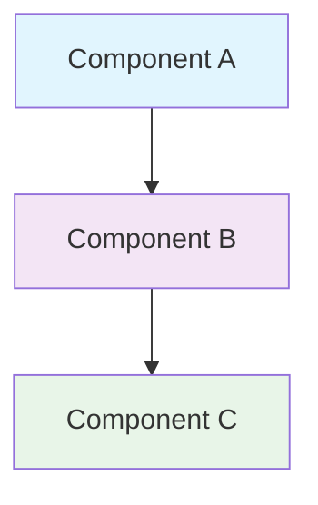

<!--
---
title: "[Document Title]"
description: "Brief, actionable description of what this document covers and its primary purpose"
author: "VintageDon - https://github.com/vintagedon"
ai_contributor: "[Full AI Model Name/Version]"
date: "YYYY-MM-DD"
version: "X.Y"
status: "[Draft/In-Review/Published/Archived]"
tags:
- type: [kb-article/how-to-guide/architecture-decision-record/runbook/etc]
- domain: [data-engineering/machine-learning/analytics/api-integration/etc]
- tech: [python/postgresql/neo4j/vector-db/steam-api/etc]
- audience: [data-scientists/ml-engineers/analysts/developers/etc]
related_documents:
- "[Related Document 1](path/to/document.md)"
- "[Related Document 2](path/to/document.md)"
---
-->

# 📋 [Document Title]

This document provides [brief overview of what this document accomplishes]. It serves as [primary function description] within the project, addressing [specific problem or need] for data scientists, analysts, and developers working with the dataset.

STYLE GUIDE: Keep the introduction to 2-3 sentences maximum. Focus on what the document delivers and its specific value. Use present tense and active voice. Be direct and avoid marketing language.

---

# 🎯 1. Introduction

This section establishes the foundational context for this document, defining its purpose, scope, intended audience, and relationship to the broader project ecosystem. It provides readers with the essential context needed to understand whether this document meets their needs and how it fits into their workflow.

STYLE GUIDE: Section 1 establishes foundational context. Keep subsections focused and concise. Use parallel structure across subsections and maintain consistent depth of coverage. Every major heading needs a blurb explaining what the section covers.

## 1.1 Purpose

This subsection clearly articulates why this document exists and what specific value it delivers to data scientists, analysts, and other users working with the Steam dataset.

STYLE GUIDE: Purpose should be one paragraph, 2-3 sentences. State the specific problem this document solves and the concrete value it provides. Avoid abstract language and focus on practical outcomes.

[2-3 sentences explaining the document's purpose, the problem it addresses, and the value it provides. Focus on outcomes and objectives.]

## 1.2 Scope

This subsection defines the precise boundaries of what this document covers, helping readers quickly assess whether the content matches their needs.

STYLE GUIDE: List what IS covered in a simple, scannable format. Avoid the "out of scope" column for public documentation - it adds unnecessary complexity. Focus on being clear about what readers will find.

What's Covered:

- [Specific area covered]
- [Another specific area covered]  
- [Additional coverage area]

## 1.3 Target Audience

This subsection identifies who should use this document and what background knowledge is expected, recognizing the wide range of skill levels in the data science community.

STYLE GUIDE: Focus on data science practitioners, Kaggle users, and researchers. Assume wide skill variation - from students to professionals. Be inclusive and avoid gatekeeping language.

Primary Users: Data scientists, ML engineers, analytics professionals  
Secondary Users: Researchers, students, developers working with gaming data  
Background Assumed: Basic familiarity with data analysis concepts; specific technical requirements noted per section

## 1.4 Overview

This subsection provides high-level context about the document's structure and how it connects to other project resources.

STYLE GUIDE: Provide a roadmap in 2-3 sentences. Reference key related documents using current repo structure. This is navigation guidance, not detailed content.

[2-3 sentences providing context about the document's structure and connections to other documentation, referencing actual repo paths from repo-tree.txt]

---

# 🔗 2. Dependencies & Relationships

This section maps how this document's subject matter integrates with other project components and external resources. It helps users understand prerequisites and related tools they may need for their analysis work.

STYLE GUIDE: Focus on technical dependencies and practical relationships that affect users' ability to use the information. Remove organizational complexity and focus on what data scientists need to know.

## 2.1 Related Components

This subsection identifies other project components that work together with the subject of this document, helping users understand the broader analytical ecosystem.

STYLE GUIDE: Use tables to show clear relationships. Link to actual files using current repo structure from repo-tree.txt. Focus on components users will actually interact with.

| Component | Relationship | Integration Points | Documentation |
|---------------|------------------|------------------------|-------------------|
| [Component Name] | [How they work together] | [Specific connection points] | [Link to actual file] |

Note: Always reference current repository structure using repo-tree.txt for accurate file paths and interlinking.

## 2.2 External Dependencies

This subsection documents external tools, APIs, or datasets required to fully utilize the functionality described in this document.

STYLE GUIDE: List external systems that users need. Include version requirements and links to official documentation. Focus on what practitioners need to install or access.

- [External Tool/API Name](link-to-official-docs) - [Brief description and version requirements]
- [Another Dependency](link) - [Description and any specific configuration notes]

---

# ⚙️ 3. Technical Documentation

This section provides the core technical content necessary for understanding, implementing, or using the documented functionality. The depth and focus varies based on document type - architectural overviews stay high-level, implementation guides include detailed steps, and API documentation focuses on usage patterns.

STYLE GUIDE: Adjust depth based on document type. Include practical examples and keep explanations clear for a wide skill range. Use simple diagrams when they enhance understanding.

## 3.1 Architecture & Design

This subsection explains the technical architecture, key design decisions, and how different components work together.

STYLE GUIDE: Focus on what users need to understand to work effectively with the system. Include simple diagrams when they clarify concepts. Avoid over-engineering explanations.

[Technical overview with architectural patterns and design rationale. Include simple diagrams when they enhance understanding.]



MERMAID STYLE GUIDE: Keep diagrams simple and accessible. Use KISS principle - prefer clarity over complexity. Avoid dramatic or overly detailed charts that may confuse users with varying technical backgrounds.

## 3.2 Implementation Details

This subsection provides specific implementation guidance, configuration examples, or key technical elements that users need to work with the documented functionality.

STYLE GUIDE: Include practical, copy-pasteable examples when possible. Use realistic data and scenarios rather than "foo/bar" placeholders. Focus on what implementers actually need.

| Element | Description | Usage Notes |
|-------------|-----------------|-----------------|
| [Technical Element] | [Clear description] | [Practical guidance] |

Table Style Guide: When using tables in subsections (### level), always include a brief introduction explaining what the table contains and why it's useful.

## 3.3 Usage Examples

This subsection demonstrates practical usage patterns and common workflows that users can adapt for their own analysis needs.

STYLE GUIDE: Provide working examples that users can copy and modify. Use realistic datasets and scenarios. Comment code clearly for users with varying experience levels.

```python
# Example: Basic usage pattern
import pandas as pd

# Load sample data
df = pd.read_csv('steam_games.csv')

# Common analysis pattern
result = df.groupby('genre').agg({
    'price': 'mean',
    'positive_ratings': 'sum'
})
```

---

# 🛠️ 4. Usage & Maintenance

This section covers practical aspects of using and maintaining the documented functionality. Note that many components may require minimal or no ongoing maintenance - include only sections that provide genuine value and avoid manufacturing documentation where none is needed.

STYLE GUIDE: Include only sections that provide real value. If there's no meaningful maintenance, monitoring, or troubleshooting guidance, omit those subsections entirely. Avoid creating content just to fill the template structure.

## 4.1 Usage Guidelines

This subsection provides practical guidance for effectively using the documented functionality in data analysis workflows.

STYLE GUIDE: Focus on best practices, common patterns, and practical tips that help users succeed. Include performance considerations and usage patterns discovered through real experience.

- Best Practices: [Key recommendations for effective usage]
- Performance Tips: [Guidance for optimal performance]
- Common Patterns: [Frequently used workflows or approaches]

## 4.2 Troubleshooting

This subsection documents solutions to common issues users may encounter, based on actual problems rather than hypothetical scenarios.

STYLE GUIDE: Include only real issues with tested solutions. Use consistent format: problem description, diagnosis approach, resolution steps. If no common issues exist, omit this section.

| Issue | Symptoms | Resolution |
|-----------|--------------|----------------|
| [Actual problem users face] | [What users observe] | [Step-by-step solution] |

## 4.3 Maintenance & Updates

This subsection outlines any regular maintenance tasks, update procedures, or version management considerations.

STYLE GUIDE: Include only if genuine maintenance is required. Many data analysis components require no ongoing maintenance. If this section would be empty or filled with generic advice, omit it entirely.

- Update Procedures: [How to handle updates when available]
- Version Compatibility: [Important compatibility considerations]
- Data Refresh: [If applicable, how to refresh or update underlying data]

---

# 📚 5. References & Related Resources

This section provides comprehensive links to related documentation, external resources, and supporting materials that extend or complement the information in this document. It serves as a gateway to deeper exploration and related learning materials.

STYLE GUIDE: Organize resources by relevance and type. Ensure all links are current and accessible. Include brief descriptions that help users choose what to explore next.

## 5.1 Internal References

This subsection links to related project documentation and resources, using current repository structure for accurate interlinking.

STYLE GUIDE: Reference actual files using repo-tree.txt structure. Organize by relationship type and include descriptions of what each document provides.

| Document Type | Title | Relationship | Link |
|-------------------|-----------|------------------|----------|
| [Type] | [Actual document title] | [How it relates to this doc] | [Actual file path from repo] |

Repository Navigation: Use current repository structure from repo-tree.txt for accurate file paths and cross-references.

## 5.2 External Resources

This subsection provides links to external documentation, research papers, datasets, or tools that provide additional context or complementary functionality.

STYLE GUIDE: Focus on authoritative sources and current information. Include academic papers, official documentation, and relevant datasets. Organize by resource type for easy scanning.

| Resource Type | Title | Description | Link |
|-------------------|-----------|-----------------|----------|
| [Official Docs] | [Title] | [What it provides] | [External link] |
| [Research Paper] | [Title] | [Relevance to this topic] | [DOI or link] |
| [Dataset] | [Title] | [How it relates] | [Access link] |

---

# 📜 6. Documentation Metadata

This section provides comprehensive information about document creation, revision history, and authorship. It maintains transparency about the document's development process and enables effective version management.

STYLE GUIDE: Maintain accurate metadata for version control and attribution. Be transparent about AI collaboration while emphasizing human responsibility for content accuracy.

## 6.1 Change Log

This subsection tracks all significant changes to the document over time, enabling users to understand what has evolved and when.

STYLE GUIDE: Use semantic versioning (major.minor format). Include meaningful change descriptions. Use ISO date format (YYYY-MM-DD) for consistency. Update with each significant revision.

| Version | Date | Changes | Author |
|------------|----------|-------------|------------|
| 1.0 | YYYY-MM-DD | Initial document creation | VintageDon |
| X.Y | YYYY-MM-DD | [Specific changes made] | [Author] |

## 6.2 Authorship & Collaboration

This subsection provides transparent attribution for all contributors, including both human authors and AI assistance used in document development.

STYLE GUIDE: Be explicit about human responsibility and AI assistance. Include links for accountability. Emphasize that human authors validate all content regardless of AI involvement.

Primary Author: VintageDon ([GitHub Profile](https://github.com/vintagedon))  
AI Assistance: [Model name and version if applicable]  
Methodology: Request-Analyze-Verify-Generate-Validate (RAVGV) when AI collaboration is used  
Quality Assurance: All content reviewed and validated by human subject matter experts

## 6.3 Technical Notes

This subsection documents any technical considerations about the document's creation, maintenance, or integration with project systems.

STYLE GUIDE: Include information about document dependencies, tooling used, or integration requirements. Omit this subsection if no special technical considerations apply.

- Documentation Tools: [Tools used for creation and maintenance]
- Integration Requirements: [Any special requirements for repo integration]
- Maintenance Notes: [Technical considerations for future updates]

*Document Version: [X.Y] | Last Updated: [YYYY-MM-DD] | Status: [Current Status]*

---

## 🔢 CRITICAL: Semantic Section Numbering System

When USING this template: If you omit sections, preserve the original numbering with gaps. Never renumber to close gaps.

- Correct: 1, 2, 3, 5, 6 (Section 4 omitted, numbering preserved)
- WRONG: 1, 2, 3, 4, 5 (Renumbered - breaks RAG system optimization)

This template structure: Sequential numbering 1-6 with no gaps, designed for the general case.

### Template Usage Principles

- No Manufacturing Documentation: Include only sections that provide genuine value
- Omit Empty Sections: If a section would contain no meaningful content, remove it entirely
- Focus on User Needs: Prioritize information that helps data scientists and analysts succeed
- Maintain Quality Standards: Every section should serve a clear purpose and provide actionable information

### Content Guidelines

- All # and ## headings need introductory blurbs explaining what the section covers
- Tables in ### sections should have brief introductions explaining their purpose
- Avoid excessive heading depth - prefer flatter information architecture
- Keep mermaid diagrams simple - use KISS principle for accessibility across skill levels
- Link using current repo structure - reference repo-tree.txt for accurate paths

### Quality Indicators

- ✅ Document serves stated purpose clearly
- ✅ All major headings include explanatory context
- ✅ Examples are practical and tested
- ✅ Links reference actual repository structure  
- ✅ Length appropriate for content and audience
- ✅ No "manufactured" content filling template structure
- ✅ Accessible to wide range of skill levels