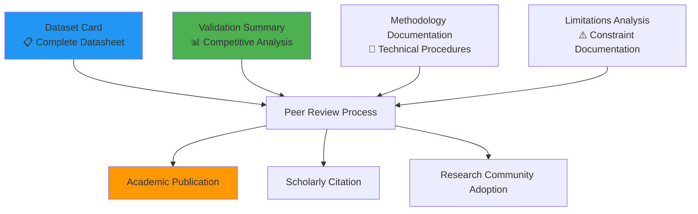

# 🎓 Steam Dataset 2025: Academic Publications

This directory contains academic-standard documentation prepared for peer review, publication, and scholarly evaluation of the Steam Dataset 2025. All materials follow established academic frameworks and provide comprehensive transparency for the research community.

---

## 📋 Academic Materials Overview

This directory serves as the central repository for all academic documentation supporting Steam Dataset 2025's contribution to the research literature. The materials are designed to support peer review processes, academic citations, and scholarly evaluation of methodological contributions.

### Academic Standards Compliance

- 📊 Established Frameworks: Following Gebru et al. (2021) datasheet standards and contemporary academic practices
- 🔍 Peer Review Ready: All documents structured for academic review and validation
- ♻️ Full Reproducibility: Complete methodological transparency enabling independent verification
- 🌍 Research Community: Designed for global academic accessibility and citation

---

## 🗂️ Directory Contents

This section provides systematic navigation to all academic materials within the Steam Dataset 2025 publication framework.

### Core Academic Documents

| Document | Framework/Standard | Purpose | Status |
|--------------|----------------------|-------------|------------|
| [Dataset Card](dataset-card.md) | Gebru et al. (2021) Datasheets | Complete academic transparency and documentation | ✅ Complete |
| [Validation Summary](validation-summary.md) | Competitive analysis framework | Academic positioning and contribution assessment | ✅ Complete |
| README.md | Academic navigation | Publication materials hub | ✅ Complete |

### Supporting Academic Resources

| Resource | Content | Academic Value |
|--------------|-------------|-------------------|
| [Citation Guide](../docs/citation.md) | Academic attribution standards | Proper scholarly citation and licensing |
| [Limitations Documentation](../docs/limitations.md) | Constraint and bias transparency | Academic honesty and research ethics |
| [Methodology Documentation](../docs/methodologies/) | Complete technical procedures | Reproducibility and validation support |

---

## 🗂️ Academic Framework Structure

Visual representation of how the academic materials support comprehensive scholarly evaluation:

### Documentation Dependencies

- 🎯 Central Framework: Dataset Card provides comprehensive academic foundation
- 📊 Positioning: Validation Summary establishes research community context
- 🔬 Technical Validation: Methodology documents support reproducibility claims
- ⚠️ Ethical Transparency: Limitations ensure academic honesty and appropriate use

---

## 🧭 Navigation by Academic Purpose

### 📋 Peer Reviewers & Journal Editors

Primary Evaluation Path:

1. [Dataset Card](dataset-card.md) - Complete academic datasheet following established standards
2. [Validation Summary](validation-summary.md) - Competitive positioning and research contributions
3. [Limitations Documentation](../docs/limitations.md) - Transparent constraint analysis
4. [Methodology Documentation](../docs/methodologies/) - Technical reproducibility validation

Key Evaluation Criteria:

- Methodological Rigor: Systematic API-pure collection with documented procedures
- Academic Transparency: Complete disclosure following Gebru et al. standards
- Research Contribution: Scale, technical innovation, and community value
- Reproducibility: Full procedures enabling independent validation

### 🎓 Academic Researchers & Citations

Research Planning Path:

1. [Validation Summary](validation-summary.md) - Understanding dataset positioning and capabilities
2. [Dataset Card](dataset-card.md) - Complete specification and usage guidelines
3. [Citation Guide](../docs/citation.md) - Proper attribution for academic publications
4. [Limitations Documentation](../docs/limitations.md) - Research scope and constraint planning

Research Applications:

- 🎮 Gaming Industry Studies: Market analysis, platform dynamics, content trends
- 🧠 Machine Learning Research: Semantic search, recommendation systems, NLP applications
- 💼 Digital Economics: Platform economics, marketplace dynamics, pricing strategies
- 📊 Data Science Methodology: Multi-modal architecture, vector search implementation

### 📚 Academic Institutions & Educators

Educational Integration Path:

1. [Dataset Card](dataset-card.md) - Understanding academic standards and best practices
2. [Methodology Documentation](../docs/methodologies/) - Technical implementation examples
3. [Validation Summary](validation-summary.md) - Research landscape and positioning
4. [Complete Documentation](../docs/) - Comprehensive learning materials

Educational Value:

- 📊 Dataset Documentation Standards: Example of Gebru et al. framework implementation
- 🏗️ Multi-Modal Architecture: Modern database design and implementation
- 🤖 AI-Assisted Methodology: RAVGV framework for systematic data engineering
- ♻️ Reproducibility Practices: Academic transparency and validation procedures

### 🏛️ Funding Agencies & Policy Makers

Assessment Framework:

1. [Validation Summary](validation-summary.md) - Research impact and community benefit
2. [Dataset Card](dataset-card.md) - Systematic methodology and quality assurance
3. [Limitations Documentation](../docs/limitations.md) - Ethical considerations and responsible use
4. [Academic Contributions](#academic-contributions--impact) - Research innovation and community value

Policy Relevance:

- 🔬 Research Infrastructure: Demonstrating systematic approach to academic data creation
- 🌍 Global Accessibility: Open access with comprehensive documentation
- 📊 Quality Standards: Academic transparency and peer review readiness
- ♻️ Reproducibility: Supporting research verification and validation

---

## 📊 Academic Standards Compliance

### Established Framework Implementation

| Framework | Implementation | Document | Compliance Level |
|---------------|-------------------|--------------|---------------------|
| Gebru et al. (2021) Datasheets | Complete 7-section datasheet | [Dataset Card](dataset-card.md) | ✅ Full Compliance |
| Academic Reproducibility | Complete methodology documentation | [Methodologies](../docs/methodologies/) | ✅ Full Transparency |
| Research Ethics | Comprehensive limitation analysis | [Limitations](../docs/limitations.md) | ✅ Ethical Standards |
| Competitive Analysis | Systematic literature positioning | [Validation Summary](validation-summary.md) | ✅ Academic Context |

### Peer Review Preparation

Documentation Completeness:

- 📋 Motivation & Purpose: Clear research objectives and gap identification
- 📊 Methodology Transparency: Complete collection and processing procedures
- 🔍 Quality Validation: Systematic testing and validation protocols
- ⚠️ Limitation Disclosure: Honest assessment of constraints and biases
- 📚 Literature Positioning: Comprehensive competitive analysis and contribution assessment

Reproducibility Support:

- ♻️ Complete Procedures: Step-by-step methodology enabling independent replication
- 🔧 Technical Specifications: Infrastructure requirements and configuration details
- 📊 Validation Protocols: Quality assurance and testing procedures
- 💾 Data Provenance: Complete audit trail from raw API responses to final dataset

---

## 🏆 Academic Contributions & Impact

### Primary Research Contributions

Methodological Innovations:

- 🔬 API-Pure Collection: First comprehensive Steam dataset using exclusively official APIs
- 🏗️ Multi-Modal Architecture: Novel integration of relational, document, and vector databases
- 🌍 Multilingual Embeddings: Systematic application of BGE-M3 for global gaming content analysis
- 📊 Academic Transparency: Complete methodology documentation following peer review standards

Scale and Coverage Achievements:

- 📈 Unprecedented Scale: 239,664 applications (10-40x larger than academic alternatives)
- 🎮 Complete Ecosystem: First dataset covering entire Steam platform (games + DLC + software + media)
- 🌍 Global Content: Native multilingual support across 100+ languages
- 📊 Population-Level Analysis: Statistical significance across all gaming genres and market segments

### Research Community Impact

Newly Enabled Research Areas:

- 🕸️ Publisher Network Analysis: Complete ecosystem relationship mapping
- 🔍 Semantic Content Discovery: Vector-based search and recommendation systems
- 📊 Market Dynamics Studies: Population-level analysis of gaming industry trends
- 🏗️ Infrastructure Research: Multi-modal database architecture for large-scale analytics

Academic Standards Advancement:

- 📋 Dataset Documentation: Exemplar implementation of established transparency frameworks
- ♻️ Reproducibility Practices: Complete methodology and infrastructure documentation
- 🤖 AI-Assisted Research: Systematic demonstration of human-AI collaboration in data engineering
- 🌍 Open Science: Comprehensive open access with academic-grade documentation

### Citation and Usage Expectations

Anticipated Research Applications:

- 📚 Academic Publications: Journal articles, conference papers, dissertation research
- 🏫 Educational Use: Classroom instruction, student projects, methodology examples
- 🔬 Comparative Studies: Baseline for other platform datasets and methodology evaluation
- 🏗️ Technical Development: Architecture examples and implementation guidance

---

## 📊 Publication Roadmap

### Current Status (September 2025)

| Material | Completion Status | Academic Standard | Peer Review Readiness |
|--------------|----------------------|----------------------|---------------------------|
| Dataset Card | ✅ Complete | Gebru et al. (2021) compliance | ✅ Ready |
| Validation Summary | ✅ Complete | Academic literature standards | ✅ Ready |
| Methodology Documentation | ✅ Complete | Reproducibility standards | ✅ Ready |
| Quality Validation | ✅ Complete | Academic transparency | ✅ Ready |

### Planned Academic Submissions

Target Venues:

- 📊 Data Science Journals: Focus on methodology and dataset contributions
- 🎮 Gaming Research Conferences: Industry application and market analysis
- 🏗️ Database Technology Venues: Multi-modal architecture and performance analysis
- 🤖 AI/ML Conferences: Vector embeddings and semantic search applications

Submission Timeline:

- Q4 2025: Initial academic submissions following Zenodo release
- Q1 2026: Conference presentations and community engagement
- Q2 2026: Journal publication and long-term academic validation

---

## 📚 Supporting Documentation

### Related Academic Resources

| Resource Type | Location | Academic Purpose |
|-------------------|--------------|---------------------|
| Technical Methodology | [docs/methodologies/](../docs/methodologies/) | Reproducibility and validation support |
| Implementation Guide | [docs/quick-start.md](../docs/quick-start.md) | Practical academic usage |
| Data Access | [docs/data-access.md](../docs/data-access.md) | Research data acquisition |
| Citation Standards | [docs/citation.md](../docs/citation.md) | Proper scholarly attribution |

### Academic Quality Assurance

| Quality Dimension | Implementation | Validation |
|----------------------|-------------------|----------------|
| Methodological Rigor | Complete procedure documentation | Peer review ready |
| Data Integrity | Systematic validation protocols | Empirically tested |
| Reproducibility | Step-by-step procedures | Independently verifiable |
| Ethical Standards | Transparent limitation disclosure | Research ethics compliant |

---

## 🤝 Academic Community Engagement

### Collaboration Opportunities

- 🔬 Research Partnerships: Joint studies leveraging dataset capabilities
- 📚 Educational Integration: Curriculum development and student projects
- 🏗️ Technical Development: Architecture improvements and extensions
- 📊 Validation Studies: Independent reproducibility and verification research

### Academic Support

- 📧 Research Inquiries: VintageDon ([GitHub](https://github.com/VintageDon)) - ORCID: [0009-0008-7695-4093](https://orcid.org/0009-0008-7695-4093)
- 🎓 Academic Collaboration: Partnership opportunities for joint research
- 📋 Citation Support: Assistance with proper attribution and usage
- ♻️ Reproducibility Assistance: Technical support for methodology replication

---

Document Information

| Field | Value |
|-----------|-----------|
| Author | VintageDon - [GitHub](https://github.com/VintageDon) |
| Created | 2025-09-07 |
| Last Updated | 2025-09-07 |
| Version | 1.0 |

---
*Tags: academic-publication, dataset-card, validation-summary, peer-review, scholarly-research*
