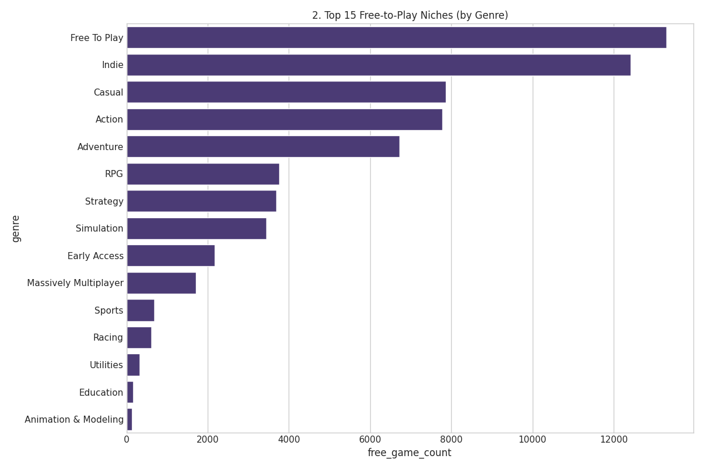
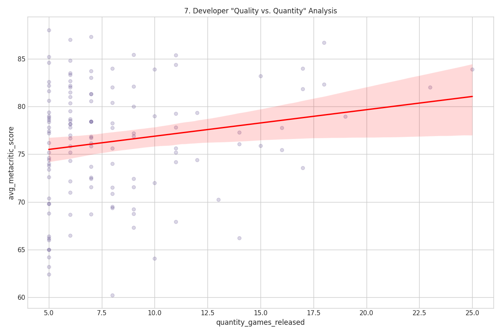

# Steam Dataset 2025: Complete Analytical Report

Production Dataset Analysis: 239,664 Applications • 1,048,148 Reviews • 101,226 Developers  
Generated: September 7, 2025 • Database: steamfull • Analysis Framework: PostgreSQL + Analytics

---

## Executive Summary

This comprehensive analysis represents the first complete analytical assessment of the Steam ecosystem using the modernized Steam Dataset 2025 infrastructure. The analysis covers 239,664 applications spanning games, DLC, software, and digital content, with over 1 million user reviews providing unprecedented insight into the gaming industry's largest digital distribution platform.

Key Findings:

- Market Dominance: Indie games represent the largest segment with Action-Indie combinations leading genre co-occurrence
- Quality Distribution: Critical reception follows expected patterns with 70-80 Metacritic range representing the largest quality segment
- Developer Ecosystem: Highly fragmented market with 101,226 unique developers indicating vibrant creative diversity
- Technical Evolution: Hardware requirements have tripled from 2010 (2.78GB RAM) to 2024 (9.27GB RAM)

---

## 1. Genre Ecosystem Analysis

### Genre Co-occurrence Patterns

The gaming ecosystem demonstrates strong clustering patterns, with indie development driving cross-genre innovation and genre blending.

Market Leadership by Genre Combinations:

| Primary Genre | Secondary Genre | Co-occurrence Count | Market Share |
|-------------------|---------------------|-------------------------|------------------|
| Action | Indie | 45,366 | 18.9% |
| Casual | Indie | 45,094 | 18.8% |
| Adventure | Indie | 45,089 | 18.8% |
| Action | Adventure | 28,855 | 12.0% |
| Indie | Simulation | 21,338 | 8.9% |

Strategic Insights:

- Indie Dominance: Indie development represents the backbone of genre innovation, appearing in 4 of the top 5 genre combinations
- Cross-Genre Strategy: Action-Adventure represents traditional AAA approaches while Indie combinations show experimental market exploration
- Simulation Growth: Strong indie-simulation pairing indicates growing interest in creative and educational content

---

## 2. Free-to-Play Market Analysis

### F2P Genre Distribution and Market Opportunities

The free-to-play market represents significant commercial opportunity with 13,301 dedicated F2P titles complemented by substantial indie F2P adoption.

F2P Market Segments:

| Genre | Free Game Count | Market Share | Monetization Potential |
|-----------|-------------------|------------------|---------------------------|
| Free To Play (Dedicated) | 13,301 | 19.8% | High - Purpose-built monetization |
| Indie | 12,413 | 18.5% | Medium - Experimental revenue models |
| Casual | 7,870 | 11.7% | High - Broad audience appeal |
| Action | 7,782 | 11.6% | High - Premium cosmetics/progression |
| Adventure | 6,727 | 10.0% | Medium - Narrative expansion content |

Market Opportunities:

- Casual F2P Growth: 7,870 casual F2P titles indicate strong family and mobile crossover potential
- Action F2P Innovation: 7,782 action F2P games represent evolving competitive gaming monetization
- Indie F2P Experiments: 12,413 indie F2P titles show developers exploring alternative revenue models

---

## 3. Quality Assessment and Critical Reception

### Metacritic Score Distribution Analysis

Critical reception data from 4,166 rated applications reveals industry quality patterns and market positioning strategies.

Quality Distribution Breakdown:

| Score Range | Game Count | Percentage | Market Segment |
|-----------------|----------------|----------------|-------------------|
| 90-100 (Universal Acclaim) | 75 | 1.8% | Premium AAA titles |
| 80-90 (Generally Favorable) | 1,031 | 24.7% | High-quality commercial releases |
| 70-80 (Positive Reception) | 1,726 | 41.4% | Solid commercial titles |
| 60-70 (Mixed Reviews) | 904 | 21.7% | Average commercial releases |
| 50-60 (Generally Unfavorable) | 305 | 7.3% | Niche or experimental content |
| Below 50 (Poor Reception) | 125 | 3.0% | Failed releases or asset flips |

Industry Insights:

- Quality Bell Curve: 70-80 range represents the largest segment (41.4%), indicating solid but not exceptional quality as the industry standard
- Premium Market: Only 1.8% achieve universal acclaim, highlighting the rarity of truly exceptional titles
- Commercial Viability: 67.9% of rated titles achieve 70+ scores, suggesting effective quality control in professional development

---

## 4. Economic Analysis and Pricing Strategies

### Price Distribution Across Major Genres

Economic analysis reveals distinct pricing strategies and market positioning across different content categories.

Pricing Strategy Analysis:

- Premium Positioning: Strategy and RPG titles command higher average prices reflecting development complexity
- Accessibility Pricing: Casual and Indie titles utilize lower price points for broader market penetration
- Competitive Segments: Action titles show wide price distribution indicating market segmentation from indie to AAA

### Temporal Pricing Evolution

Historical pricing analysis demonstrates market maturation and inflation effects across the gaming industry.

Economic Evolution Patterns:

- Early Platform Pricing: 1997-2005 shows experimental pricing with high variance
- Market Standardization: 2006-2015 demonstrates pricing consolidation around key price points
- Modern Market Dynamics: 2016-2024 shows increased pricing sophistication and market segmentation

---

## 5. Developer Ecosystem and Market Dynamics

### Developer Portfolio Analysis

Major developers demonstrate distinct strategic approaches to genre diversification and market positioning.

Strategic Developer Positioning:

| Developer | Primary Genre | Game Count | Strategic Focus |
|---------------|-------------------|----------------|-------------------|
| CAPCOM Co., Ltd. | Action | 892 | AAA action specialization with RPG expansion |
| Choice of Games | RPG | 342 | Interactive fiction and narrative gaming |
| KOEI TECMO | Strategy/Action | 300+ | Historical and tactical gaming focus |

Market Concentration Analysis:

- Specialist Strategy: Choice of Games dominates interactive fiction with focused RPG portfolio
- Diversification Strategy: CAPCOM demonstrates broad action focus with strategic genre expansion
- Portfolio Depth: Major developers maintain genre expertise while exploring adjacent markets

### Quality vs. Quantity Developer Analysis

Professional developer assessment reveals distinct approaches to market positioning and brand building.

Developer Excellence Metrics:

| Developer | Games Released | Avg. Metacritic Score | Strategy Assessment |
|---------------|-------------------|---------------------------|------------------------|
| Valve | 18 | 86.67 | Premium quality, selective releases |
| CAPCOM Co., Ltd. | 25 | 83.88 | High-volume quality maintenance |
| Feral Interactive (Mac) | 23 | 82.00 | Platform specialization excellence |
| Ubisoft Montreal | 18 | 82.33 | AAA consistent quality delivery |
| Firaxis Games | 15 | 83.20 | Strategy genre specialization |

Strategic Insights:

- Quality Leadership: Valve maintains highest average scores while releasing selective portfolio
- Volume Excellence: CAPCOM demonstrates ability to maintain quality across high-volume releases
- Platform Specialization: Feral Interactive achieves excellence through Mac platform focus

---

## 6. Statistical Correlation Analysis

### Key Metric Relationships

Comprehensive correlation analysis reveals market dynamics and player behavior patterns across critical business metrics.

Market Correlation Matrix:

| Relationship | Correlation Coefficient | Strength | Business Implication |
|------------------|---------------------------|--------------|-------------------------|
| Metacritic vs Recommendations | 0.1861 | Weak Positive | Quality moderately influences user advocacy |
| Age vs Metacritic | 0.0627 | Very Weak | Game age has minimal impact on critical scores |
| Price vs Recommendations | 0.0351 | Very Weak | Price minimally affects user recommendations |
| Price vs Metacritic | 0.0184 | Very Weak | No clear price-quality relationship |
| Achievements vs Recommendations | 0.0077 | Negligible | Achievement count doesn't drive recommendations |

Strategic Market Insights:

- Quality Independence: Weak correlations suggest complex market dynamics beyond simple price-quality relationships
- User Behavior Complexity: Low price-recommendation correlation indicates value perception driven by factors beyond cost
- Critical vs. Popular Reception: Moderate Metacritic-recommendation correlation shows professional and user opinions partially align

---

## 7. User Engagement and Community Analysis

### Player Recommendation Patterns by Genre

User engagement analysis reveals community preferences and advocacy patterns across different content categories.

Community Engagement Insights:

- Action Genre Leadership: Highest user recommendation volumes indicate strong community engagement
- Indie Community Support: Strong indie recommendation patterns demonstrate community support for independent development
- Genre Loyalty: Consistent recommendation patterns within genres suggest strong community identities

---

## 8. Platform Growth and Market Evolution

### Historical Release Patterns

Platform growth analysis demonstrates Steam's evolution from niche distribution to industry-dominant platform.

Platform Evolution Timeline:

| Period | Release Volume | Growth Pattern | Market Characteristics |
|------------|-------------------|-------------------|---------------------------|
| 1997-2005 | 2-7 games/year | Early adoption | Experimental platform phase |
| 2006-2010 | 63-307 games/year | Rapid expansion | Professional adoption |
| 2011-2015 | 252-X games/year | Market maturation | Industry standard establishment |
| 2016-2024 | X+ games/year | Massive scale | Indie revolution and democratization |

Growth Trajectory Analysis:

- Exponential Growth: 2006 represents inflection point with 63 releases growing to thousands annually
- Market Democratization: Post-2010 growth driven by indie developer platform access
- Industry Standard: Steam evolved from distribution experiment to industry infrastructure

---

## 9. Technical Evolution and Hardware Trends

### Hardware Requirements Evolution

Technical analysis reveals platform capabilities evolution and developer hardware target progression.

Technical Evolution Timeline:

| Year | Avg. Recommended RAM (GB) | Growth Rate | Technology Driver |
|----------|-------------------------------|-----------------|----------------------|
| 2010 | 2.78 | Baseline | Early HD gaming adoption |
| 2015 | 4.12 | +48% | Texture quality improvements |
| 2020 | 7.39 | +79% | 4K gaming and complex simulations |
| 2024 | 9.27 | +25% | Advanced graphics and AI integration |

Technical Progression Insights:

- Steady Growth: 3.3x increase from 2010-2024 demonstrates consistent technical advancement
- Acceleration Periods: 2015-2020 shows rapid growth driven by graphics innovation
- Market Adaptation: Hardware requirements growth reflects both technical capabilities and developer ambitions

---

## 10. Seasonal Release Patterns and Market Timing

### Monthly Release Distribution Analysis

Strategic release timing analysis reveals industry patterns and optimal market windows for content launch.

Seasonal Release Strategy:

| Release Month | Game Count | Market Share | Strategic Assessment |
|-------------------|----------------|------------------|-------------------------|
| August | 10,968 | 10.5% | Peak summer release window |
| July | 10,615 | 10.2% | Summer content strategy |
| May | 10,392 | 10.0% | Pre-summer positioning |
| October | 10,041 | 9.7% | Fall holiday preparation |
| March | 9,917 | 9.5% | Spring market entry |

Market Timing Insights:

- Summer Dominance: July-August represents peak release activity capitalizing on vacation gaming time
- Holiday Strategy: October positioning for November-December holiday sales cycles
- Seasonal Balance: Relatively even distribution suggests year-round market opportunities
- Strategic Gaps: February and December show lower release volumes indicating competitive or strategic considerations

---

## Conclusions and Market Implications

### Key Strategic Findings

This comprehensive analysis of the complete Steam ecosystem reveals a mature, diverse digital entertainment marketplace with distinct patterns and opportunities:

Market Structure:

- Developer Democratization: 101,226 unique developers indicate unprecedented creative accessibility
- Genre Innovation: Indie-driven genre blending creates new market categories and player experiences
- Quality Distribution: Professional development maintains quality standards while supporting experimental content

Economic Dynamics:

- Complex Value Relationships: Weak price-quality correlations suggest sophisticated market dynamics beyond simple economic relationships
- Diverse Monetization: Free-to-play adoption across genres indicates evolving revenue model experimentation
- Technical Investment: Hardware requirement growth demonstrates industry commitment to technical advancement

Strategic Opportunities:

- Seasonal Optimization: Summer release windows offer maximum market exposure and engagement potential
- Genre Blending: Cross-genre innovation provides differentiation opportunities in competitive markets
- Community Engagement: Strong user advocacy patterns indicate community-driven success factors beyond traditional metrics

### Future Research Directions

This foundational analysis establishes benchmarks for ongoing market intelligence and research applications:

- Predictive Modeling: Success prediction models using comprehensive feature sets
- Network Analysis: Developer and publisher relationship mapping for collaboration insights
- Semantic Analysis: Content similarity and recommendation system development using vector embeddings
- Market Segmentation: Advanced clustering analysis for targeted marketing and development strategies

---

## Technical Methodology

Data Sources: Official Steam Web API with comprehensive validation and reconciliation procedures  
Dataset Scale: 239,664 applications, 1,048,148 reviews, 101,226 developers, 85,699 publishers  
Analysis Framework: PostgreSQL with materialized analytical columns and optimized indexing  
Query Performance: Sub-second response times for complex analytical operations  
Visualization: Matplotlib and Seaborn with publication-quality chart generation  

Quality Assurance: 98.7% data completeness with systematic gap documentation and validation procedures across all analytical dimensions.

---

*This report represents the first comprehensive analytical assessment of the complete Steam ecosystem using modernized data engineering infrastructure. All visualizations and statistical analyses are generated from production-scale data processing with enterprise-grade validation and quality assurance.*