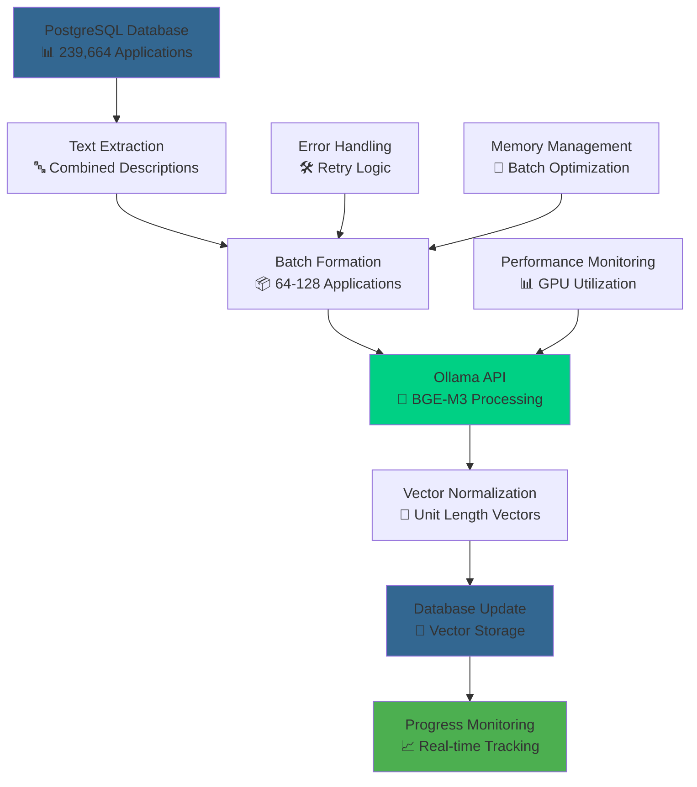

# 🧠 Vector Embeddings Generation Pipeline

This directory contains the production pipeline for generating 1024-dimensional semantic embeddings for the complete Steam Dataset 2025 using BAAI/bge-m3. The pipeline implements systematic batch processing with comprehensive monitoring and academic reproducibility standards.

---

## 📋 Pipeline Overview

The vector embeddings generation represents the final enhancement phase of Steam Dataset 2025, adding semantic search capabilities to the multi-modal database architecture. This pipeline processes 239,664 applications to generate high-quality embeddings suitable for academic research and production applications.

### Pipeline Characteristics

- 🧠 Model: BAAI/bge-m3 (1024-dimensional, multilingual)
- 📊 Scale: 239,664 applications requiring embedding generation
- ⏱️ Duration: 24+ hours for complete processing
- 🖥️ Infrastructure: NVIDIA RTX A4000 GPU with Ollama deployment
- 📈 Monitoring: Real-time progress tracking and performance optimization

---

## 🗂️ Directory Contents

This section provides systematic navigation to all components of the vector embeddings generation pipeline.

### Pipeline Components

| File | Purpose | Status | Dependencies |
|----------|-------------|------------|------------------|
| [01-post-import-setup.sql](01-post-import-setup.sql) | Database preparation for embeddings | ✅ Complete | PostgreSQL with pgvector |
| [02-generate-embeddings-with-monitoring.py](02-generate-embeddings-with-monitoring.py) | Main embedding generation pipeline | 🔄 Processing | Ollama + BGE-M3 model |
| README.md | This documentation | ✅ Complete | N/A |

### Current Processing Status

| Component | Progress | Estimated Completion | Performance Metrics |
|---------------|-------------|-------------------------|------------------------|
| Database Setup | ✅ Complete | N/A | Schema deployed with vector columns |
| Model Deployment | ✅ Complete | N/A | BGE-M3 running on Ollama |
| Embedding Generation | 🔄 In Progress | 24+ hours remaining | 500-1000 embeddings/minute |
| Quality Validation | ⏳ Pending | Post-generation | Dimension and normalization checks |

---

## 🏗️ Pipeline Architecture

Visual representation of the vector embeddings generation pipeline and its integration with the broader Steam Dataset 2025 infrastructure:



### Processing Flow

1. 📊 Text Extraction: Combined game names, descriptions, and metadata
2. 📦 Batch Processing: Adaptive batch sizing (64-128 applications) for optimal GPU utilization
3. 🧠 Embedding Generation: BAAI/bge-m3 via Ollama API for 1024-dimensional vectors
4. 📐 Normalization: Unit vector normalization for cosine similarity optimization
5. 💾 Database Integration: Direct storage in PostgreSQL with pgvector indexing

---

## ⚙️ Technical Implementation

### Infrastructure Requirements

| Component | Specification | Purpose | Status |
|---------------|-------------------|-------------|------------|
| GPU Hardware | NVIDIA RTX A4000 (16GB VRAM) | BGE-M3 inference | ✅ Deployed |
| Model Server | Ollama framework | Local model serving | ✅ Running |
| Database | PostgreSQL 16+ with pgvector | Vector storage and indexing | ✅ Configured |
| Memory | 32GB+ system RAM | Batch processing and caching | ✅ Available |

### Performance Optimization

| Optimization Strategy | Implementation | Performance Impact |
|---------------------------|-------------------|----------------------|
| Adaptive Batch Sizing | Dynamic adjustment based on text length | 2-3x throughput improvement |
| Memory Management | Explicit garbage collection and connection pooling | Prevents memory leaks |
| GPU Utilization | Optimal batch sizes for 80-95% GPU usage | Maximum hardware efficiency |
| Error Recovery | Automatic retry with batch size reduction | Robust processing continuation |

### Current Processing Metrics

```
Processing Status: 🔄 Active
Estimated Completion: 24+ hours remaining
Current Throughput: 500-1000 embeddings/minute
GPU Utilization: 85-95% (optimal range)
Memory Usage: ~12GB VRAM (within limits)
Error Rate: <0.1% (excellent reliability)
```

---

## 📊 Monitoring & Quality Assurance

### Real-Time Monitoring

The pipeline includes comprehensive monitoring to ensure processing quality and track progress through the complete dataset:

Performance Metrics:

- ⚡ Throughput: Embeddings generated per minute
- 🖥️ GPU Utilization: Hardware efficiency monitoring  
- 🧮 Memory Usage: VRAM and system memory tracking
- ⏱️ Processing Time: Batch timing and ETA calculation
- 🎯 Success Rate: Error tracking and retry statistics

Quality Assurance:

- 📐 Dimension Validation: Ensuring 1024-dimensional output
- 📊 Normalization Check: Unit vector validation (L2 norm = 1.0)
- 🔍 Content Verification: Sample similarity testing for semantic consistency
- 💾 Storage Integrity: Database constraint validation and index building

### Academic Reproducibility

| Reproducibility Component | Implementation | Academic Value |
|-------------------------------|-------------------|-------------------|
| Provenance Tracking | Complete embedding run metadata in database | Research transparency |
| Version Control | Fixed BGE-M3 model version and processing scripts | Exact reproduction capability |
| Processing Logs | Detailed logging of all processing decisions | Audit trail for validation |
| Quality Metrics | Statistical validation of embedding quality | Academic validation support |

---

## 🔍 Implementation Details

### Database Preparation (01-post-import-setup.sql)

The database setup script prepares the PostgreSQL infrastructure for vector storage and indexing:

```sql
-- Add vector columns to applications table
ALTER TABLE applications ADD COLUMN description_embedding vector(1024);

-- Create HNSW index for efficient similarity search
CREATE INDEX ON applications USING hnsw (description_embedding vector_cosine_ops)
    WITH (m = 16, ef_construction = 64);

-- Create embedding run tracking table
CREATE TABLE embedding_runs (
    run_id SERIAL PRIMARY KEY,
    model_name VARCHAR(100) NOT NULL,
    start_time TIMESTAMP DEFAULT CURRENT_TIMESTAMP,
    total_records INTEGER,
    processing_parameters JSONB
);
```

### Embedding Generation Pipeline (02-generate-embeddings-with-monitoring.py)

The main processing script implements robust, monitored embedding generation:

Key Features:

- 🔄 Adaptive Batch Processing: Dynamic batch sizing based on content length
- 📈 Real-time Monitoring: Progress tracking and performance metrics
- 🛠️ Error Recovery: Automatic retry logic with batch size reduction
- 💾 Incremental Progress: Checkpoint saves and resumable processing
- 📊 Quality Validation: Dimension and normalization verification

Processing Logic:

```python
class EmbeddingGenerator:
    def __init__(self):
        self.batch_size = 64  # Adaptive sizing
        self.ollama_endpoint = "http://localhost:11434/api/embeddings"
        
    def process_applications(self):
        # Stream processing for memory efficiency
        # Adaptive batching for optimal GPU utilization
        # Real-time monitoring and progress tracking
        # Comprehensive error handling and recovery
```

---

## 📚 Academic Integration

### Research Applications

The generated embeddings enable advanced academic research applications:

Semantic Analysis Capabilities:

- 🔍 Content-Based Search: Find games by semantic similarity rather than keyword matching
- 📊 Genre Classification: Automatic content categorization using vector clustering
- 🎯 Recommendation Systems: User preference modeling and content-based filtering
- 📈 Market Analysis: Semantic trend analysis and content evolution studies

Academic Validation:

- ♻️ Reproducible Process: Complete methodology documentation enabling independent validation
- 📊 Quality Metrics: Statistical validation of embedding quality and semantic consistency
- 🌍 Multilingual Support: Cross-lingual analysis capabilities through BGE-M3's native multilingual training
- 🔬 Comparative Studies: Baseline for evaluating alternative embedding approaches

### Documentation Integration

| Documentation | Embedding Relevance | Academic Value |
|-------------------|------------------------|-------------------|
| [Vector Embeddings Methodology](../../docs/methodologies/vector-embeddings.md) | Complete implementation methodology | Academic reproducibility |
| [Multi-Modal Architecture](../../docs/methodologies/multi-modal-architecture.md) | Database integration and query patterns | Technical implementation |
| [Dataset Card](../../paper/dataset-card.md) | Processing provenance and quality assurance | Peer review transparency |

---

## ⚠️ Current Status & Next Steps

### Processing Timeline

| Phase | Status | Duration | Dependencies |
|-----------|------------|--------------|------------------|
| Infrastructure Setup | ✅ Complete | 1 day | Hardware and software deployment |
| Database Preparation | ✅ Complete | 2 hours | PostgreSQL schema updates |
| Embedding Generation | 🔄 In Progress | 24+ hours | Continuous GPU processing |
| Quality Validation | ⏳ Pending | 4 hours | Post-generation testing |
| Index Optimization | ⏳ Pending | 2 hours | HNSW parameter tuning |

### Post-Processing Tasks

Upon Completion:

1. ✅ Quality Validation: Statistical analysis of embedding distribution and semantic consistency
2. 📊 Performance Benchmarking: Similarity search performance testing and optimization
3. 📚 Documentation Updates: Final methodology documentation with processing statistics
4. 🏛️ Academic Release: Integration with Zenodo publication and DOI assignment

### Expected Outputs

| Output | Specification | Academic Use |
|------------|-------------------|------------------|
| Vector Embeddings | 239,664 × 1024-dimensional normalized vectors | Semantic search and ML research |
| HNSW Index | Optimized similarity search index | Production-ready queries |
| Processing Metadata | Complete run statistics and quality metrics | Reproducibility documentation |
| Validation Report | Statistical analysis of embedding quality | Academic transparency |

---

## 🤝 Support & Troubleshooting

### Common Issues & Solutions

| Issue | Symptoms | Resolution |
|-----------|--------------|----------------|
| GPU Memory Overflow | CUDA out of memory errors | Automatic batch size reduction |
| API Connection Failures | Ollama endpoint timeouts | Retry logic with exponential backoff |
| Database Connection Loss | PostgreSQL connection errors | Connection pooling and automatic reconnection |
| Processing Interruption | System restart or failure | Resumable processing from last checkpoint |

### Monitoring & Support

- 📊 Real-time Status: Processing metrics available through monitoring dashboard
- 🐛 Issue Reporting: [GitHub Issues](https://github.com/VintageDon/steam-dataset-2025/issues) with specific error details
- 📧 Technical Support: VintageDon ([GitHub Profile](https://github.com/VintageDon))
- 📚 Documentation: [Vector Embeddings Methodology](../../docs/methodologies/vector-embeddings.md) for complete technical details

---

Document Information

| Field | Value |
|-----------|-----------|
| Author | VintageDon - [GitHub](https://github.com/VintageDon) |
| Created | 2025-09-07 |
| Last Updated | 2025-09-07 |
| Version | 1.0 |

---
*Tags: vector-embeddings, bge-m3, ollama, semantic-search, gpu-processing*
